# Prototype Development

A walkthrough of three functional prototypes built to compare three different paradigms of in-video AI support: learner-initiated, continuously available, and system-initiated.

---

## Contents

1. The Shared Foundation
2. The Intermittent Prototype
3. The Continuous Prototype
4. The Proactive Prototype
5. Putting the Three Side by Side
6. Implementation Rationale, Trade-offs, and Limitations

---

# Section 1: The Shared Foundation

> **Try the prototypes:** all three are deployed and accessible at **[learn-pal-demos.vercel.app](https://learn-pal-demos.vercel.app/)**. The three cards on that page open the Intermittent, Continuous, and Proactive versions respectively. The first load of each may take ~30 seconds while the free-tier service warms up; subsequent navigation is instant. The deployed versions match the study build, with the participant-tracking instrumentation disabled (see Section 4.9).

Before describing the three prototypes individually, this section walks through what they have in common. All three are built on the same technical base, with the same data model, the same instrumentation, and the same set of safeguards around the AI's output. Only one route on the server, and the on-screen panels themselves, actually differ between them. Isolating the shared parts here first allows the per-prototype sections to stay focused on what makes each design distinctive.

A reader who reads only this section should walk away with a clear picture of three things: how the apps are structured, how a study session flows from open-the-page to export-the-data, and what guardrails are in place so that the AI does not undermine the comparison.

## 1.1 What sits behind the screen

Every prototype is a small web application. The participant opens it in a browser; behind the scenes, three things are at work.

1. A **frontend** written in React. This is the visible interface, including the video player, the chat sidebar, and the panels and overlays that vary by paradigm.
2. A **backend** written in Node.js (using Express). This handles a handful of request types: session creation, chat messages, quiz generation, snap captures, behaviour event logging, and data export. Two of the three prototypes also have an *analyse* route that runs the AI on transcript chunks in the background — but that one is what differs, and is covered in those sections.
3. A **local SQLite database file** that stores everything for the session.

These three pieces talk to one or more **AI providers** over the internet, or to a local model running on the same machine where one is available. Whichever provider is selected, the prompts and the response handling are identical. Only the message format differs slightly between vendors.

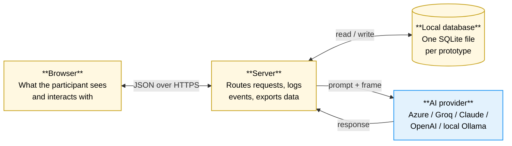
```mermaid
%% A simplified view of how the three layers communicate.
flowchart LR
    Browser["**Browser**<br/>What the participant sees<br/>and interacts with"]:::layer
    Server["**Server**<br/>Routes requests, logs<br/>events, exports data"]:::layer
    DB[("**Local database**<br/>One SQLite file<br/>per prototype")]:::layer
    AI["**AI provider**<br/>Azure / Groq / Claude /<br/>OpenAI / local Ollama"]:::external

    Browser <-->|JSON over HTTPS| Server
    Server <-->|read / write| DB
    Server -->|prompt + frame| AI
    AI -->|response| Server

    classDef layer fill:#fff8e1,stroke:#c8a420,stroke-width:1.5px,color:#000
    classDef external fill:#e3f2fd,stroke:#2196f3,stroke-width:1.5px,color:#000
```

The stack was deliberately kept small. There is no hosting, no authentication, and no cloud database. Every prototype runs on a researcher's laptop. That choice traded production-level infrastructure for rapid modification during pilot testing, which mattered far more in practice.

## 1.2 The technology choices, briefly explained

| What | Choice | Why |
|---|---|---|
| Frontend framework | React + Vite | React allows complex, stateful interfaces to be built without re-inventing patterns; Vite keeps the development loop nearly instant. |
| Video player | The browser's own `<video>` element | YouTube's embedded player blocks the kind of frame-grabbing the AI needs. A local MP4 file gives full control. |
| Backend | Node.js with Express | The simplest possible HTTP server. A new route can be added in two minutes. |
| Database | SQLite (single file) | No database server to install or configure. The whole study's data sits in a single, easily portable file. |
| AI calls | Plain HTTP fetch to each provider | No SDK lock-in. Providers can be swapped in the UI by changing a single variable. |
| Export | Multi-sheet Excel and CSV | The researcher opens it in whatever tool they prefer (Excel, R, Python). |

### The AI providers

The same six providers are wired into all three prototypes. The participant's session uses whichever one is currently selected; switching is logged as a `provider_switched` event so we know exactly which model produced which response.

| Provider key | Model behind it | Can it look at images? | Notes |
|---|---|---|---|
| `azure` | GPT-4o mini (Azure-hosted) | yes | The default during the study. |
| `azure-54` | GPT-5.4 mini (Azure-hosted) | yes | A second slot, kept available for comparison runs. |
| `groq` | Llama 3.3 70B | text only | Low-latency text-only fallback, used when no frame is being sent. |
| `claude` | Claude Sonnet 4.6 | yes | Anthropic's API, used in fallback runs. |
| `openai` | GPT-4o | yes | Standard OpenAI endpoint. |
| `ollama` | Llama 3.2 (local) | depends on model | A local fallback for offline testing. |

## 1.3 How a study session actually unfolds

The participant does not think about any of this infrastructure. From their perspective, a session is six steps long.

1. **They land on the page.** A modal asks for a participant ID (`P03`, `C04`, `I05`...). They cannot interact with anything else until they enter one or click *Skip for testing*. Skipping does **not** create a database record, so test runs do not pollute the real participant data.
2. **The session begins.** As soon as a real ID is entered, the app sends a single message to the server: "create a session for participant P03 in the Proactive condition". The server replies with an ID. From that moment on, every chat message, every quiz answer, and every click is tagged with that ID.
3. **They watch the video.** The same 17-minute video plays in every prototype. The transcript scrolls alongside the video. They can pause, seek, and change playback speed.
4. **They interact with the AI**, in whichever way the prototype allows. (This is the point of the comparison; how this step looks is exactly what differs between the three designs.)
5. **They reach the end**, either by playing through, or because the session is complete. The researcher can hit a *Reset* button to clear the screen for the next participant; the previous data stays safe in the database.
6. **The researcher exports the data.** A single button downloads a multi-sheet Excel file containing every session's events, messages, and quizzes for analysis.

Several small details in this flow (in particular the careful separation of "ID entered" from "session created", and what *Reset* should and should not do) were tightened only after the first pilots exposed bugs in the data. The full story is in Section 4.3.

## 1.4 What the database actually stores

Every prototype writes to the same five tables. The database file is local to that prototype's server, but the structure is identical.

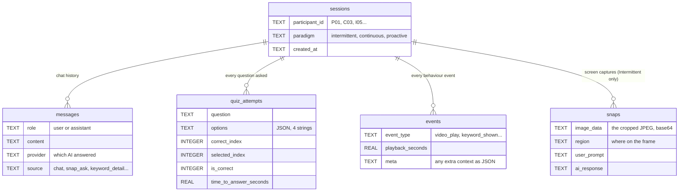
```mermaid
%% The five tables. "sessions" is the parent; everything else hangs off it.
%% When a session is deleted, all its child rows are deleted with it.
erDiagram
    sessions ||--o{ messages : "chat history"
    sessions ||--o{ quiz_attempts : "every question asked"
    sessions ||--o{ events : "every behaviour event"
    sessions ||--o{ snaps : "screen captures (Intermittent only)"

    sessions {
        TEXT participant_id "P01, C03, I05..."
        TEXT paradigm "intermittent, continuous, proactive"
        TEXT created_at
    }
    messages {
        TEXT role "user or assistant"
        TEXT content
        TEXT provider "which AI answered"
        TEXT source "chat, snap_ask, keyword_detail..."
    }
    quiz_attempts {
        TEXT question
        TEXT options "JSON, 4 strings"
        INTEGER correct_index
        INTEGER selected_index
        INTEGER is_correct
        REAL time_to_answer_seconds
    }
    events {
        TEXT event_type "video_play, keyword_shown..."
        REAL playback_seconds
        TEXT meta "any extra context as JSON"
    }
    snaps {
        TEXT image_data "the cropped JPEG, base64"
        TEXT region "where on the frame"
        TEXT user_prompt
        TEXT ai_response
    }
```

The simplest way to think about this: `sessions` is the participant's run; the other four tables are the things that happened *during* that run. Chat goes to `messages`, quiz answers to `quiz_attempts`, all the rest goes to `events`. The `snaps` table is only really used in the Intermittent prototype, where the participant manually crops a region of the video to ask about; in the other two it sits empty.

## 1.5 What is logged, and why

There are two streams of data. The **content stream** lives in `messages` and `quiz_attempts`, and captures *what* the participant said and *what* the AI replied. The **behaviour stream** lives in `events`, and captures *what they did* and *when*.

The behaviour stream is the more interesting one for the comparison, because it lets us reconstruct the rhythm of a session second by second. Some events are shared by all three prototypes:

| What happened | Event name | Why it matters |
|---|---|---|
| Participant pauses the video | `video_pause` | A signal of effort; participants who pause more often are working harder. |
| Participant seeks (jumps to a different part) | `video_seek` | Indicates re-watching, often after confusion. |
| Participant clicks a transcript line | `transcript_clicked` | Shows the transcript is being used as a navigation tool. |
| Participant changes playback speed | `playback_speed_changed` | Speeding up suggests boredom or familiarity; slowing down suggests struggle. |
| Tab loses or gains focus | `tab_blurred` / `tab_focused` | A proxy for whether the participant is paying attention. |
| Participant sends a chat message | `chat_message_sent` | Constructive engagement: producing content, not just consuming it. |
| Participant changes AI provider | `provider_switched` | Useful for investigating model effects on behaviour. |
| The browser tab is closing | `session_end` | Recorded via `sendBeacon` so the final video position is captured even on crash. |

Each prototype adds its own paradigm-specific events on top of this base. Those are listed in their respective sections.

### The Excel export

When the researcher hits *Export*, they receive a single `.xlsx` file with five sheets:

| Sheet | One row per | Contains |
|---|---|---|
| **Comparable** | Session | Aggregate metrics designed for cross-paradigm comparison (engagement counts, quiz accuracy, ICAP buckets) |
| **Messages** | Chat message | Provider, source tag, role, full content |
| **Quizzes** | Quiz attempt | Question, options, what was selected, time to answer |
| **Snaps** | Snap | Timestamp, region, user prompt (image data is excluded to keep the file small) |
| **Events** | Logged event | The full behaviour stream |

The *Comparable* sheet is the one that does the heavy lifting for analysis. It groups raw events into ICAP buckets: Active behaviour (pausing, seeking, transcript-reading), Constructive behaviour (asking questions, answering quizzes), and Interactive behaviour (back-and-forth dialogue with the AI). It also computes an "AI acceptance rate": of all the AI suggestions the participant saw, what fraction did they actually engage with?

The exact bucketing is paradigm-specific. What counts as a "suggestion shown" looks different in a paradigm where the AI never speaks unprompted, compared to one where it interrupts on a schedule. The comparison section (Section 3) explains how these differences map to one another.

## 1.6 Keeping the AI honest

Generative AI is helpful but unreliable. Given the chance, it will repeat itself, anchor on the first answer choice in its prompt, surface things that are not really technical concepts, and write quiz questions that test memorisation rather than understanding. The shared safeguards below are what stop these tendencies from breaking the study.

**Shuffled answer options.** Whenever a quiz question is generated, the four answer options are shuffled on the server before being sent to the participant. Without this, the AI overwhelmingly placed the correct answer at position A, anchored by the JSON example in the prompt. The entire study would then have measured "can the participant click the first option" rather than learning. After this was noticed in pilots, the shuffle made the answer position genuinely random.

**An explicit anti-recall rule in the quiz prompt.** Every quiz prompt forbids verbatim recall and demands that the wrong answers be plausible misconceptions of similar length and structure. The same wording is used in all three prototypes so quiz quality stays constant when comparing learning outcomes.

**A JSON repair step.** AI responses are supposed to be valid JSON. They sometimes are not (a missing comma, an unquoted key). Rather than failing silently, the server runs a small repair pass that recovers most malformed responses. This rescued roughly five percent of pilot calls.

**Cross-feature awareness.** When the participant asks the chat a question, the system prompt includes everything the AI has already shown them in this session: past quiz questions, glossary terms, and highlights. That way, the chat does not redefine concepts the participant has already seen, and it does not ignore the rest of the experience. The same context is fed back into the analysis call (in the two prototypes that have one), so the AI does not waste a glossary slot on a term the participant just asked about in chat.

## 1.7 What is actually different between the three prototypes

After all of the above, the genuine differences come down to a handful of things. Everything else is shared.

| Aspect | Intermittent | Continuous | Proactive |
|---|---|---|---|
| Does the AI speak without being asked? | No, never | Yes, fills side panels in the background | Yes, actively interrupts with popups, overlays, and quizzes |
| Is there a background "analyse" route? | No | Yes (every 4 transcript rows) | Yes (every 2 transcript rows) |
| Does the participant crop frames manually? | Yes (Snap-to-ask) | No | No |
| Are there live feeds in the UI? | None | Glossary, highlights, questions | Keyword popups, region overlays, pop quizzes |
| Is there a frequency setting? | n/a | n/a | Yes, Low / Medium / High |
| Does the AI adapt its own pacing? | No | No | Yes, auto up/down based on participant behaviour |

The next three sections take each of these prototypes in turn and explain, design rationale first and technical detail in support, how it actually works.


---

# Section 2a: The Intermittent Prototype

## 2a.1 The design hypothesis

The Intermittent prototype is built around a single design idea: the AI should be available, but it should never speak first. The participant always has a chat sidebar open, and there are two extra ways of asking the AI for help, by snapping a region of the video, or by asking for a quiz question. Every one of those interactions begins with a deliberate click. The AI remains silent until the learner explicitly requests support.

This is the most restrained of the three designs, and that is the point. It serves as the **control condition** in the comparison: it tells us what learners do when generative help is *available but invisible*. Anything the other two prototypes produce, including extra engagement, more constructive behaviour, or better quiz performance, has to be measured against this baseline. If the silent version already produces strong engagement, the case for active AI is weaker. If the silent version produces little, the case is stronger.

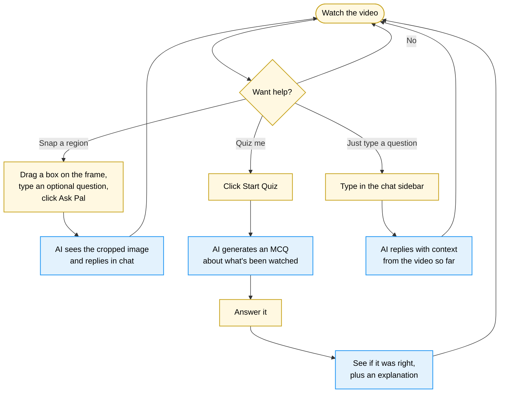
```mermaid
%% How a learner moves through the Intermittent prototype.
%% Yellow = the learner's actions. Blue = what the AI does in response.
flowchart TD
    Watch(["Watch the video"]):::user
    Want{"Want help?"}:::user

    Watch --> Want
    Want -->|"No"| Watch

    Want -->|"Snap a region"| Snap["Drag a box on the frame,<br/>type an optional question,<br/>click Ask Pal"]:::user
    Snap --> SnapAI["AI sees the cropped image<br/>and replies in chat"]:::ai
    SnapAI --> Watch

    Want -->|"Quiz me"| Quiz["Click Start Quiz"]:::user
    Quiz --> QuizAI["AI generates an MCQ<br/>about what's been watched"]:::ai
    QuizAI --> Answer["Answer it"]:::user
    Answer --> Feedback["See if it was right,<br/>plus an explanation"]:::ai
    Feedback --> Watch

    Want -->|"Just type a question"| Chat["Type in the chat sidebar"]:::user
    Chat --> ChatAI["AI replies with context<br/>from the video so far"]:::ai
    ChatAI --> Watch

    classDef user fill:#fff8e1,stroke:#c8a420,stroke-width:1.5px,color:#000
    classDef ai fill:#e3f2fd,stroke:#2196f3,stroke-width:1.5px,color:#000
```

## 2a.2 What is on the screen

The screen has three columns. On the left, a thin rail with a settings icon. In the middle, the video player and its controls. On the right, the chat sidebar, which is the same "Ask Pal" interface that appears in every prototype.

Just below the video are two **feature cards**, the only places where AI can be invoked beyond the chat:

- **Snap to ask Pal**, for asking about something visible on screen.
- **Quiz me now**, for testing oneself on what has been covered so far.

Below those is the transcript, scrolling automatically as the video plays. Clicking any line jumps the video to that timestamp.

<figure class="screenshot">
  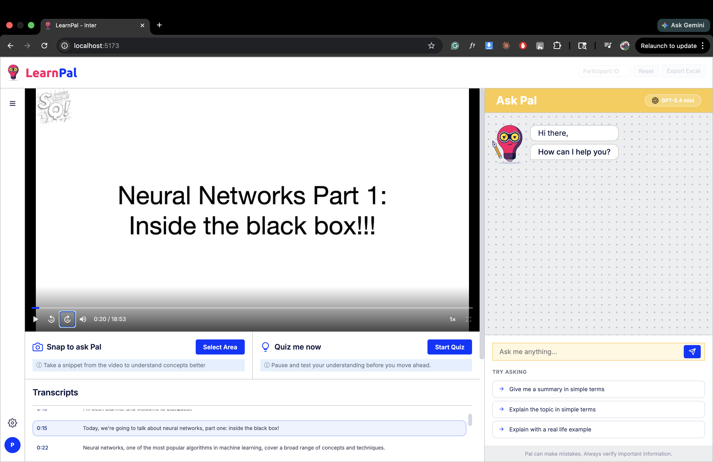
  <figcaption><strong>Screenshot 2a-A.</strong> The default state: video at the top, two feature cards (Snap and Quiz) below it, the transcript further down, and the chat sidebar on the right. The chat is empty; suggested prompts are offered as starting points. Nothing has happened yet, this is what every session begins with.</figcaption>
</figure>

## 2a.3 The Snap-to-ask flow

This is the most distinctive interaction in this prototype, and it is worth walking through in detail.

When the learner sees something in the video they want to ask about, such as a diagram, a label, or a part of an equation, they click **Select Area**. The video pauses, and a hint strip appears: *Drag to select an area, then ask Pal.* They drag a rectangle on the frame. Below a minimum size (28 × 28 pixels) the rectangle is rejected, so an accidental click cannot trigger a snap.

Once they release, a confirmation card appears with their selection visible, an optional text field ("Ask about this..."), and **Ask Pal** / **Cancel** buttons. They can refine what they are asking before sending.

<figure class="screenshot">
  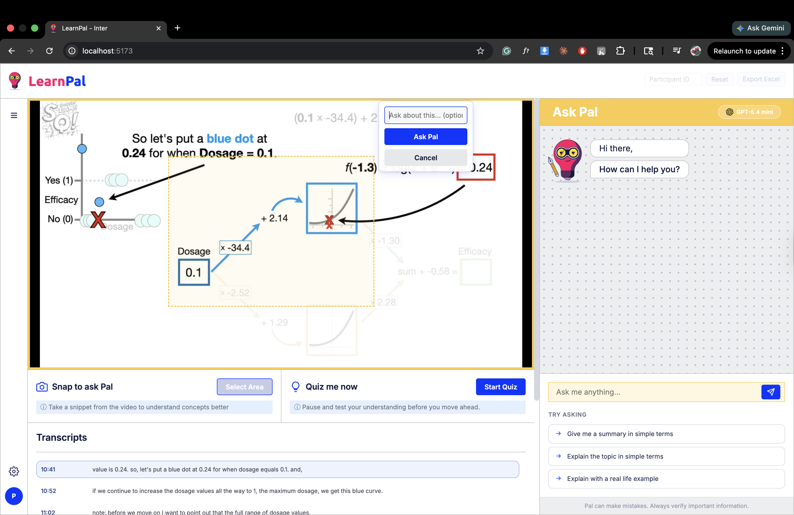
  <figcaption><strong>Screenshot 2a-B.</strong> The selection-confirm step. The learner has drawn a rectangle around part of the diagram and is about to type a question or click Ask Pal directly. The rectangle is editable up to this point; once they confirm, the frame is captured.</figcaption>
</figure>

Clicking **Ask Pal** triggers the browser's screen-share permission prompt. The learner picks the tab containing the video, and a single frame is grabbed. Importantly, the system captures *what is actually on the screen at that moment*, including any subtitles or zoom state, rather than reading directly from the video file. That matches the mental model of "what I am looking at right now". The trade-off is the visible permission dialog, which adds a little friction.

The captured frame is cropped to the selection rectangle and encoded as a JPEG image. That image, along with a synthesised prompt that includes the timestamp and a 50-second window of surrounding transcript, is sent to the AI. The reply appears in the chat as a normal message, but with a thumbnail of the snapped region attached so the participant (and the researcher, later) can see exactly what was asked about.

<figure class="screenshot">
  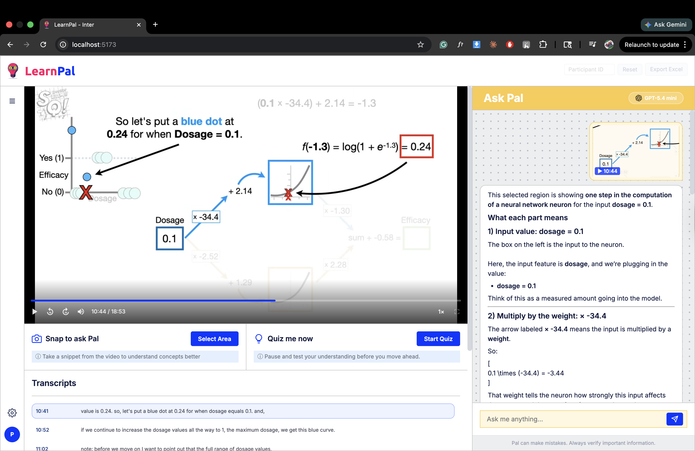
  <figcaption><strong>Screenshot 2a-C.</strong> The result of a snap. The user's chip in chat carries a thumbnail of what they asked about; the AI's reply below is a normal markdown response. Everything (the image, the prompt, the response) is also saved to the database for later review.</figcaption>
</figure>

## 2a.4 The Quiz-me-now flow

The quiz works differently to the snap. There is no automatic firing; the learner has to click **Start Quiz** to see anything. When they do, the modal opens with a brief loading spinner while the AI generates a question.

The question itself is a multiple-choice question (MCQ): four options, one correct. Behind the scenes, the AI is given the full transcript watched so far, the difficulty level for this attempt, and a list of every question already asked in this session (so it does not repeat itself). The four answer options are then shuffled on the server before being shown, which stops the AI's habit of always making the first option correct.

<figure class="screenshot">
  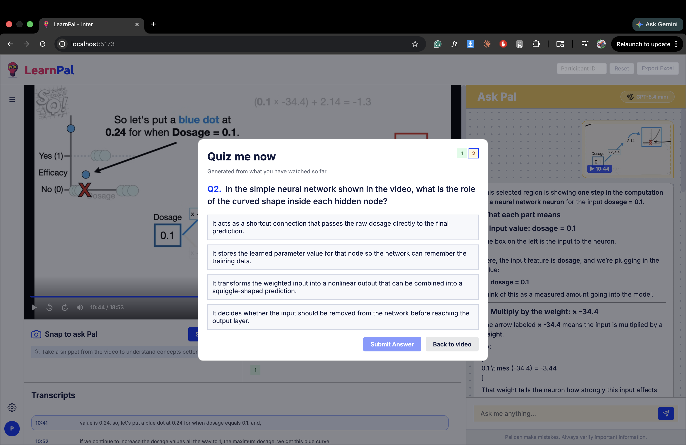
  <figcaption><strong>Screenshot 2a-D.</strong> The quiz modal shows a single question with four answer options. The numbered pills at the top represent past questions in this session, and clicking any of them lets the learner revisit a previous attempt and its explanation.</figcaption>
</figure>

Once the learner submits an answer, the modal switches into feedback mode: the correct option turns green, the chosen one (if wrong) turns red, and a short explanation appears below.

<figure class="screenshot">
  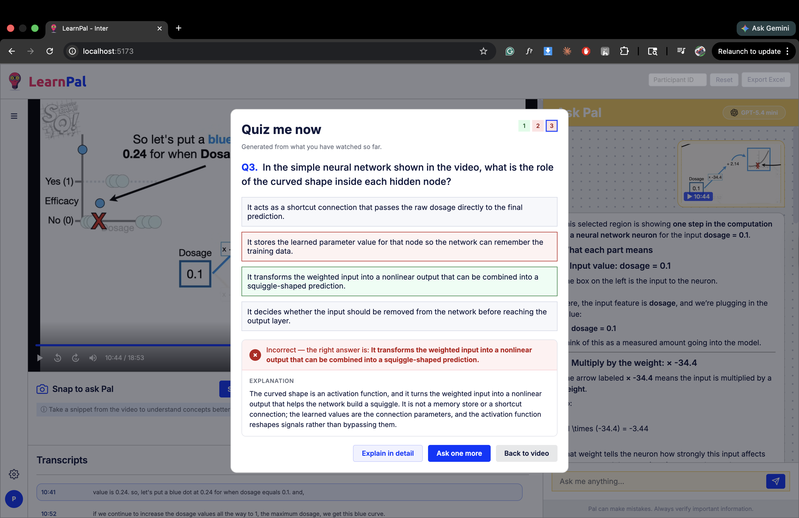
  <figcaption><strong>Screenshot 2a-E.</strong> The feedback state. The learner sees not only whether they were right, but a short explanation of why, written by the AI, and an option to ask Pal for more detail in chat.</figcaption>
</figure>

**Adaptive difficulty.** The quiz tracks consecutive correct answers in a hidden counter. Two right in a row, and the next question is bumped up a level (Conceptual → Applied → Creative; the AI is told to write harder questions). One wrong, and the counter resets. The participant does not see the difficulty number, only the experience of harder questions when they are doing well.

**Question history.** The numbered pills at the top of the modal are persistent across the whole session. The learner can close the modal and re-open it many times; the history is always there, ready to be revisited. Whether participants actually use this, by clicking back into a question for review, is itself a research signal.

## 2a.5 What is happening in the code

Most of the complexity in this prototype lives on the client side, in a single state machine that drives the screen between modes:

```
default_viewing → selection_mode → selection_confirm → default_viewing
default_viewing → quiz_loading → quiz_open → quiz_feedback → default_viewing
```

There is **no background loop**. The server has no `/api/analyse` route at all; that route exists only in the other two prototypes. The Intermittent server is genuinely smaller, with only six endpoints (sessions, chat, quiz, snaps, events, and export). This is part of why the project was built as three separate apps rather than one with toggles: the differences are visible all the way down to the file system.

The pieces of state that matter most:

| Variable | What it tracks |
|---|---|
| `mode` | Which screen the learner is on (default viewing, selecting a region, quiz open, etc.) |
| `selectionRect` | The bounding box of the snap as it is being drawn |
| `currentQuiz`, `quizHistory`, `askedQuestions` | The active question, plus everything previously asked |
| `quizDifficulty`, `consecutiveCorrect` | The hidden adaptive difficulty state |
| `messages` | The chat history |
| `participantId`, `pidConfirmed` | Whether the modal has been confirmed (the gate that decides whether the database is touched at all) |

## 2a.6 The AI prompts

Three different prompts are used:

| Where | What the prompt contains |
|---|---|
| Chat | A description of who Pal is, the current video timestamp, the last six lines of transcript, the participant's quiz history, any past snaps, and an instruction to never cite the video as a source. |
| Snap | The same chat system prompt, plus a user message containing the timestamp, a 50-second transcript window around it, and the cropped image. |
| Quiz | The full transcript watched so far, an instruction at the current difficulty level, the list of previously-asked questions, and a strict quality gate (no verbatim recall, no joke options, distractors must be plausible misconceptions). |

Every chat exchange is also tagged in the database with a `source` label (`chat`, `snap_ask`, `quiz_explain`), so genuine conversational use can later be separated from incidental help-seeking in the analysis.

## 2a.7 Events that are unique to this prototype

In addition to the shared events listed in Section 1.5, the Intermittent prototype logs:

| Event | When it fires | What it tells us |
|---|---|---|
| `snap_started` | The learner clicks **Select Area** | They began a snap, regardless of whether they finished one. |
| `snap_cancelled` | The confirmation card was cancelled | They abandoned a snap. The ratio of cancelled to completed is a measure of confidence or hesitation. |
| `snap_completed` | The capture and AI call both succeed | A snap actually went through. |
| `quiz_started` | They clicked **Start Quiz** | Self-initiated assessment is one of the very few "AI suggestion shown" moments in this prototype. |
| `quiz_correct` / `quiz_wrong` | They submitted an answer | Includes time-to-answer and difficulty. |
| `quiz_skipped` | They closed the modal without submitting | A signal of disengagement. |
| `quiz_review_opened` | They clicked a history pill | Genuine review behaviour, going back to look at a past question. |

In the export's *Comparable* sheet, the count of `quiz_started` is what is reported as "AI suggestions shown" for this paradigm. The corresponding "AI suggestions accepted" is the count of any answered or completed quiz, plus completed snaps.

## 2a.8 The design decisions worth flagging

A handful of choices in this prototype are non-obvious, and deserve mention:

- **Real screen capture, not video-element reading.** Snaps use the browser's `getDisplayMedia` API rather than reading frames directly from the `<video>` element. This was deliberate. It matches "what I see on screen right now" rather than "what is in the video file". It also means subtitles, zoom levels, and any browser overlays get captured. The cost is the visible permission dialog.
- **Snap image data is persisted to the database.** Unlike the frame captures used in Continuous and Proactive, which are sent to the AI and discarded, Intermittent's snaps are saved. A researcher can later see exactly what each participant asked about. It also makes the database larger.
- **Quiz history is per-session, not per-learner.** Two different sessions for the same person produce independent quiz histories. This was a study-design choice; each session is meant to be a self-contained run.
- **Adaptive difficulty is hidden.** The difficulty number is never shown to the participant. They feel the questions getting harder, but they never see "Level 2" appear on screen. This avoids the gamification frame that would have changed the experience.

## 2a.9 What this prototype cannot do

A few honest limitations to note:

- The snap requires the participant to grant screen-share permission. If they deny it, the feature is unusable for that session.
- There is no "second look": once a snap is sent, the learner cannot re-crop or re-ask without starting over. Edit-after-send was considered and rejected; the friction of starting over makes each snap more deliberate, which is a study-relevant property.
- The chat does not have access to past snaps' images, only the text around them. Follow-up questions about a previously snapped diagram lose their visual context.
- The prototype assumes a participant with at least basic English literacy (the AI replies and the transcript are both English). This is a common limitation across all three.


---

# Section 2b: The Continuous Prototype

## 2b.1 The design hypothesis

The Continuous prototype is built around a different hypothesis from Intermittent: the AI should not wait to be asked, but it should not interrupt either. Instead, it should always be present, quietly populating side panels with relevant content as the video plays. The learner can sample what they want, when they want; nothing demands attention, nothing pauses the video, but help is always within reach.

Where Intermittent provides on-demand AI support that remains hidden until the learner requests it, Continuous provides ambient AI support that is always visible alongside the video. The cost of looking at help is reduced almost to zero, because the help is already there.

Three streams of content build up as the video plays: a **glossary** of technical terms being introduced, a feed of **explore highlights** worth pausing on, and a paced feed of **live questions** to test understanding. Each stream lives in its own panel; each accumulates over time. The chat sidebar is still available for free-form questions, just as in Intermittent.

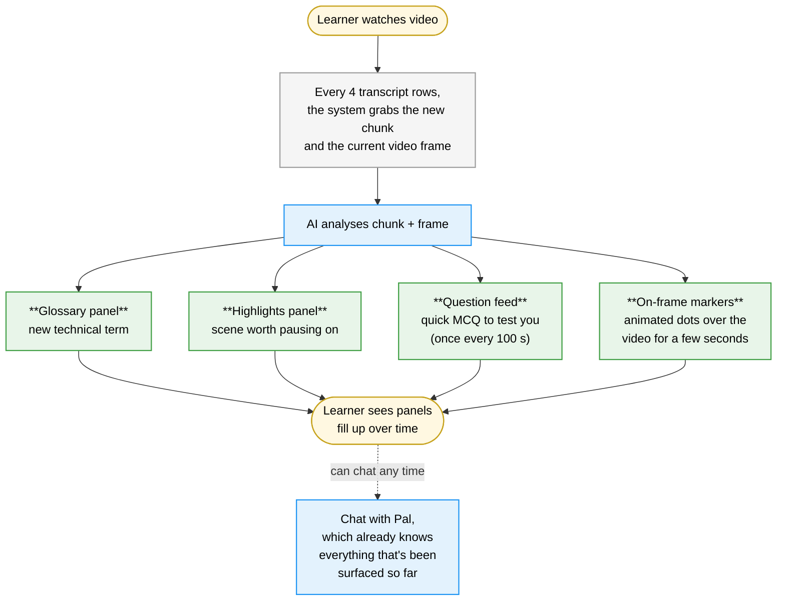
```mermaid
%% In Continuous, the AI runs in the background as the video plays.
%% Every few transcript rows, it analyses the recent chunk plus a frame,
%% and routes its output into one of three side panels.
flowchart TD
    Watch(["Learner watches video"]):::user
    Tick["Every 4 transcript rows,<br/>the system grabs the new chunk<br/>and the current video frame"]:::sys
    Watch --> Tick
    Tick --> AI["AI analyses chunk + frame"]:::ai

    AI --> Glossary["**Glossary panel**<br/>new technical term"]:::ui
    AI --> Highlights["**Highlights panel**<br/>scene worth pausing on"]:::ui
    AI --> Questions["**Question feed**<br/>quick MCQ to test you<br/>(once every 100 s)"]:::ui
    AI --> Regions["**On-frame markers**<br/>animated dots over the<br/>video for a few seconds"]:::ui

    Glossary --> Sees(["Learner sees panels<br/>fill up over time"]):::user
    Highlights --> Sees
    Questions --> Sees
    Regions --> Sees

    Sees -.->|"can chat any time"| Chat["Chat with Pal,<br/>which already knows<br/>everything that's been<br/>surfaced so far"]:::ai

    classDef user fill:#fff8e1,stroke:#c8a420,stroke-width:1.5px,color:#000
    classDef ai fill:#e3f2fd,stroke:#2196f3,stroke-width:1.5px,color:#000
    classDef sys fill:#f5f5f5,stroke:#9e9e9e,stroke-width:1.5px,color:#000
    classDef ui fill:#e8f5e9,stroke:#43a047,stroke-width:1.5px,color:#000
```

## 2b.2 What is on the screen

The layout is the same three-column shell as Intermittent, but the content is very different. The video player is still in the centre, but immediately below it is a horizontally split **secondary row** containing two panels side by side: the highlights feed on the left, the live question feed on the right. The right column is divided in two by a draggable divider: the glossary panel takes the top half, and the chat sits in the bottom half.

This means the learner is looking at four streams of information at once: the video, the highlights and questions below it, and the glossary and chat to its right. The visual challenge is that none of these should compete with the video for attention, but all of them should be glanceable.

<figure class="screenshot">
  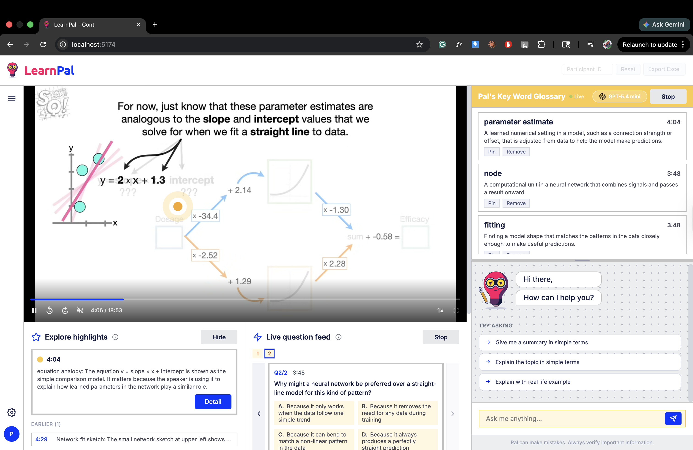
  <figcaption><strong>Screenshot 2b-A.</strong> The defining state of this paradigm. After a few minutes of playback, the glossary on the right has accumulated several technical terms; the highlights panel has at least one scene to revisit; the live question feed has surfaced a question. The learner has done nothing to make any of this happen.</figcaption>
</figure>

## 2b.3 The four streams of generated content

Each time the AI runs in the background, it produces up to four kinds of output, each routed to a different surface.

| Stream | Where it appears | How much per run | What stops it from repeating |
|---|---|---|---|
| **Glossary terms** | Right-column panel; new entries slide in | Up to 2 new terms | A blocklist of generic English words, plus dedup against everything already shown |
| **Highlights** | Secondary-row left panel | At most 1 | Fuzzy-substring dedup against everything already shown, so "neural network diagram" and "the neural net diagram" are recognised as duplicates |
| **Questions** | Secondary-row right panel | At most 1 | A 100-second timer between questions, regardless of how many the AI proposes |
| **Region markers** | Animated dots on the video itself | Up to 3 per run | Coordinate clamping; minimum size; the dots disappear after a few seconds |

The glossary and highlights are persistent; they keep accumulating. The on-frame region markers are deliberately transient; they appear with a subtle entry animation, hold for about four seconds, and dismiss themselves. They are closer to "look here for a moment" than to "here is something to revisit later".

<figure class="screenshot">
  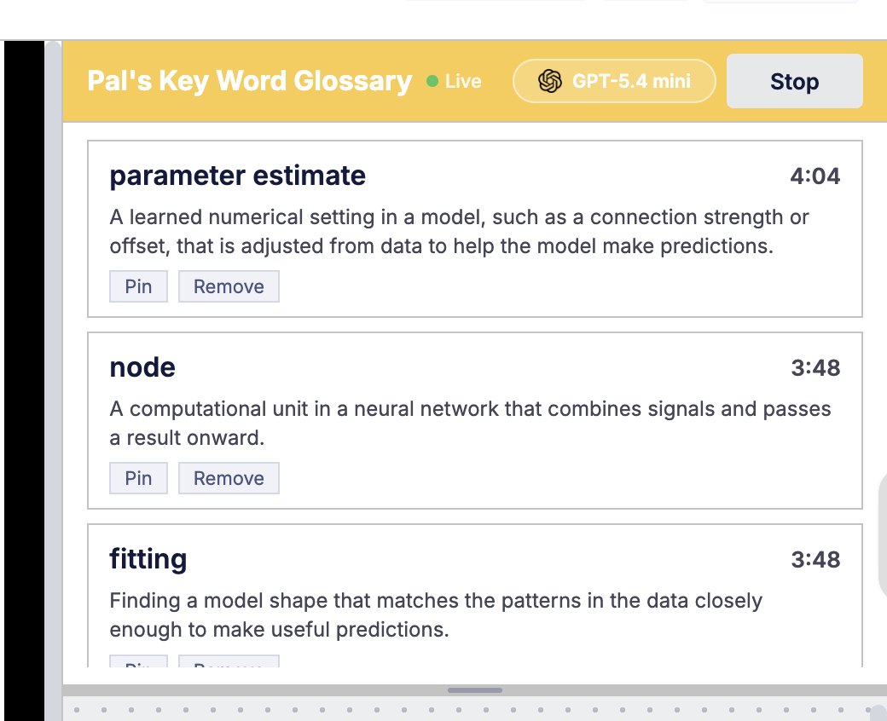
  <figcaption><strong>Screenshot 2b-B.</strong> The glossary panel header. There is a small "Stop" button that pauses the glossary feed (without affecting the others), and a provider toggle that cycles between AI providers if needed. The same controls appear above each of the other panels.</figcaption>
</figure>

<figure class="screenshot">
  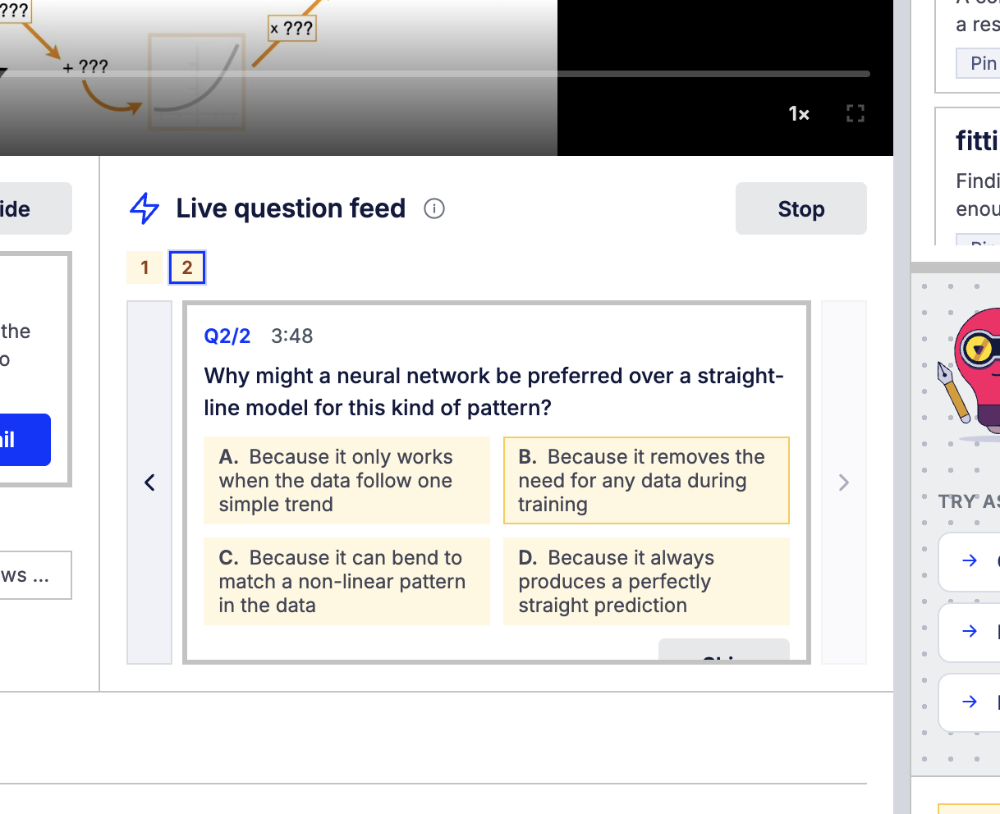
  <figcaption><strong>Screenshot 2b-C.</strong> A live question card. Four answer options, no selection yet. The numbered pills above the card represent past questions; the participant can navigate back to any of them at any time.</figcaption>
</figure>

<figure class="screenshot">
  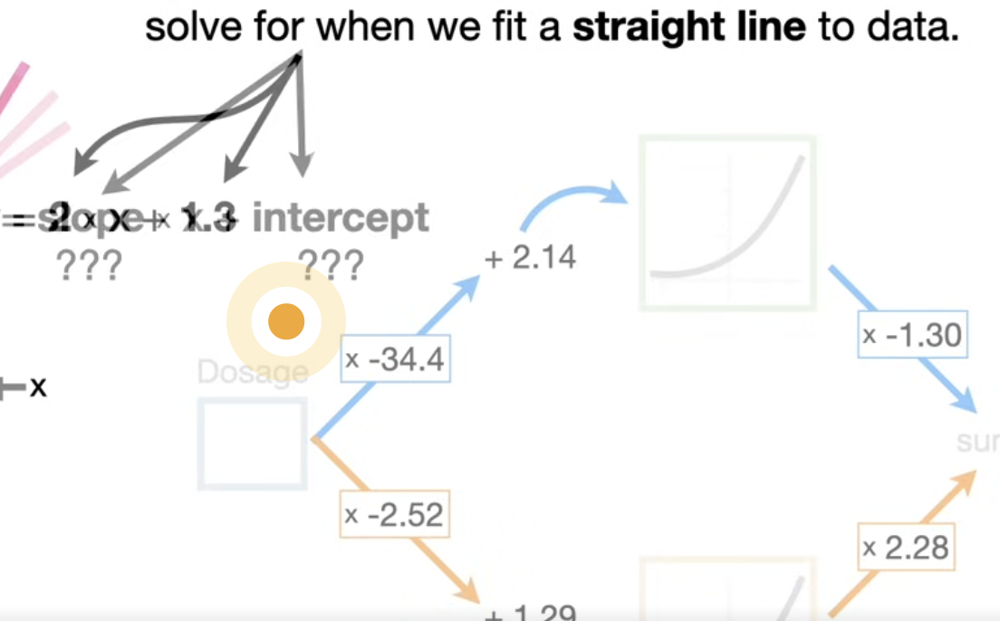
  <figcaption><strong>Screenshot 2b-D.</strong> A region marker in the middle of its lifetime. Concentric circles draw the eye to a specific element, here an axis label, for a few seconds before dismissing. It is the briefest of interventions.</figcaption>
</figure>

<figure class="screenshot">
  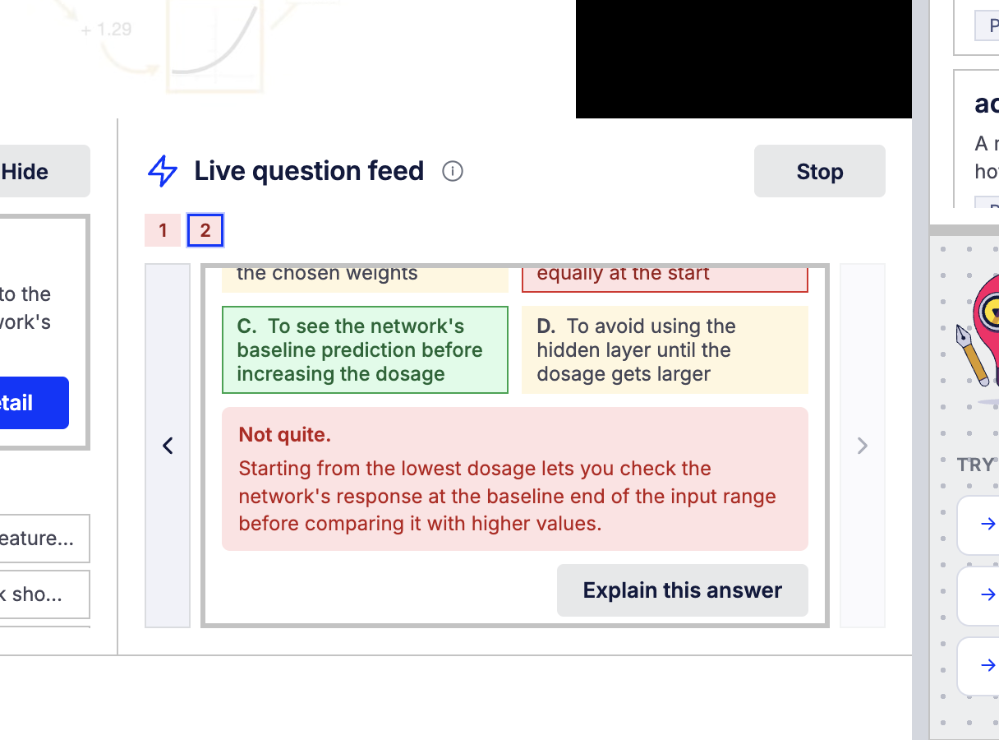
  <figcaption><strong>Screenshot 2b-E.</strong> The post-answer state of a feed question. Correct/wrong is indicated visually; an "Explain this answer" link routes the question into chat for a deeper conversation if the learner wants one.</figcaption>
</figure>

<figure class="screenshot">
  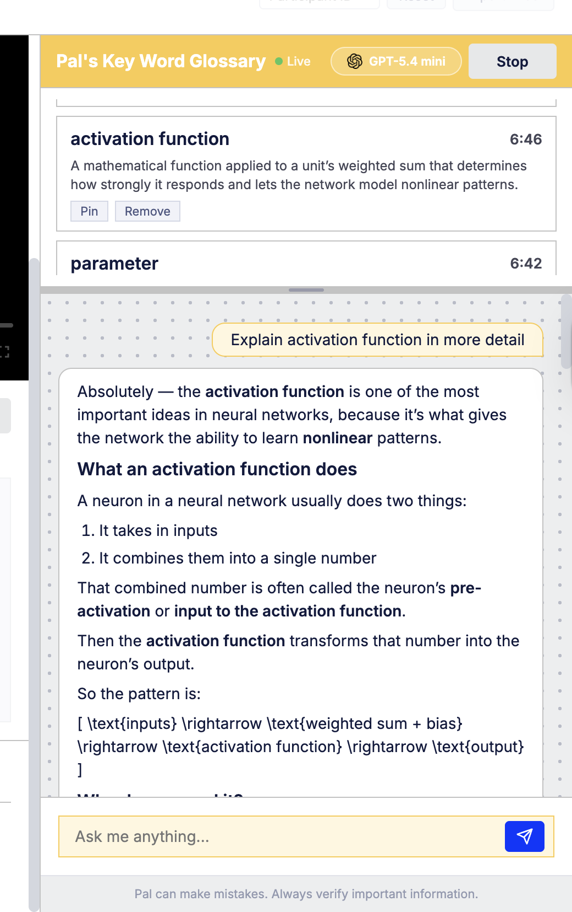
  <figcaption><strong>Screenshot 2b-F.</strong> Chat awareness in action. The learner has asked a follow-up question; Pal's reply assumes the term that was already surfaced in the glossary panel rather than redefining it. The cross-feature context is what makes this feel like one assistant rather than four disconnected ones.</figcaption>
</figure>

## 2b.4 The background loop, in plain language

What turns this into an "ambient" experience is a small piece of logic that runs continuously while the video plays. It works like this:

1. The participant's video position is sampled every half-second.
2. Whenever four new transcript rows have been covered since the last analysis, the loop fires.
3. The system grabs the most recent chunk of transcript (between four and twelve rows). If a video frame is available, it captures a small JPEG of what is currently on screen (480 × 270 pixels, compressed to about 20 KB).
4. The chunk and the frame are sent to the AI, along with everything that has already been surfaced in this session (so it knows what not to repeat) and the participant's last few chat messages (so it knows what they are already exploring on their own).
5. The AI responds with up to four streams of output (glossary, highlights, questions, regions), and each stream is routed to its corresponding panel.

The 100-second question throttle deserves an explanation of its own. Without it, the AI would happily produce a question on almost every analysis run, which during one early pilot meant **eight questions in three minutes**. The throttle ensures roughly one question per 100 seconds of playback, about ten questions across the 17-minute video, which matches what felt natural to participants. The timer runs on the participant's actual video position, so pausing the video pauses the timer.

## 2b.5 Per-feed pause controls

Each of the three accumulating panels has its own pause/resume button. This was a design decision worth flagging: a single "stop everything" button would have been simpler, but it would have collapsed three distinct cognitive loads into one signal. By giving each panel its own pause, the data tells us *which* stream a participant found overwhelming. Some participants paused glossary but kept questions running. Some did the opposite. Those choices are themselves data.

A paused panel keeps showing what is already there; new content for that stream is silently dropped while it is paused.

## 2b.6 What the chat knows about everything else

In Intermittent, the chat is informed by quiz history and snap history. In Continuous, the chat is informed by *all four* streams: every glossary term, every highlight, every question, plus the participant's previous messages. When the participant asks Pal a question, the system prompt already lists everything they have seen.

This has a concrete effect on the conversation. If the glossary already explained "activation function", the chat does not redefine it from scratch; it builds on top of it. If the question feed has just surfaced a question about gradient descent, a follow-up chat message about that topic gets a reply that addresses the participant's specific misconception (because the wrong answer they picked is in the prompt too).

The same context flows in the other direction: when the analysis loop runs, the participant's last few chat messages are passed to the AI so it does not waste a glossary slot on a term they are already discussing in chat.

## 2b.7 What is happening in the code

The Continuous client manages substantially more state than Intermittent because it has to track each accumulating stream separately:

| Variable / ref | What it tracks |
|---|---|
| `liveGlossary`, `liveHighlights`, `liveQuestions` | The three accumulating arrays, one per panel |
| `frameRegions` | The transient on-frame markers currently being rendered |
| `lastAnalysedRowRef` | The position of the last transcript row analysed (drives the four-row gate) |
| `lastQuestionAtRef` | The video time of the last question that made it past the throttle |
| `isAnalysingRef` | A flag that prevents two analysis calls running at once |
| `feedDifficulty`, `feedConsecCorrect` | The adaptive difficulty for the live question feed |

A small but important pattern: every accumulating array exists *both* as React state (so the UI re-renders when it changes) *and* as a ref (so the analysis callback can read its current value without restarting). This is unavoidable when you have a long-lived background loop reading from rapidly changing state.

The new server route in this prototype is `/api/analyse`. Given a transcript chunk, an optional frame, and the previous-content arrays for dedup, it returns the four streams of output. The same route exists in Proactive but with different prompt rules.

## 2b.8 Events that are unique to this prototype

Beyond the shared events listed in Section 1.5, Continuous logs:

| Event | When it fires | What it tells us |
|---|---|---|
| `glossary_term_clicked` | The learner clicks a glossary entry | They engaged with a surfaced term rather than just glancing at it. |
| `feed_question_unlocked` | A question cleared the throttle and entered the feed | The system surfaced an AI suggestion. |
| `feed_question_answered` | The learner submitted an answer | Includes correctness, difficulty, and time-to-answer. |
| `feed_question_skipped` | They explicitly skipped a question | A rejection of the AI suggestion. |
| `feed_question_jumped` | They clicked a past question pill | Review behaviour. |
| `feed_paused` / `feed_resumed` | They toggled the pause control on a feed | Tells us which stream they chose to mute. |
| `highlight_detail_clicked` | They clicked the Detail button on a highlight | Routes the highlight into chat for a deeper explanation. |
| `explain_answer_clicked` | "Explain this answer" link after a feed question | Help-seeking after submission. |

In the *Comparable* export, "AI suggestions shown" combines `feed_question_unlocked` with `highlight_detail_clicked`. "AI suggestions accepted" combines answered questions, glossary clicks, and explain-requests. "AI suggestions rejected" combines skipped questions and pause events.

## 2b.9 The design decisions worth flagging

- **Three feeds, not one combined feed.** An earlier sketch tried to put glossary, highlights, and questions in a single chronological column. Pilot participants reported it was harder to scan than three separate panels, because the eye could not predict which kind of content was where. Splitting them made each surface scannable on its own terms, even at a glance.
- **Time-based throttle, not chunk-based throttle.** The 100-second gap between questions is in playback time, not analysis count. This way, a participant who pauses heavily is not bombarded when they resume, and a participant who watches at 2× speed is not starved.
- **Per-feed pause, not global.** Discussed above. Letting participants regulate one stream at a time produces a richer signal for analysis than a single panic button.
- **Chat context fed back into analysis.** This closes the loop between the chat and the panels. Without it, the same term would appear in glossary that the participant had just spent five minutes asking about in chat.

## 2b.10 What this prototype cannot do

- The four-row analysis gate assumes the participant moves forward through the video. Heavy seeking, especially backwards, can momentarily starve the loop until enough new rows are covered.
- On-frame region markers depend on local-video frame capture. If the same study were run on YouTube embeddings, the regions would silently disappear, leaving only three streams.
- The chat-context window passed back to analysis is hard-capped (last four messages, 120 characters each). Long-running conversational threads lose detail at this boundary.
- "Pause" only freezes the *acceptance* of new items, not the underlying AI call. A paused feed still consumes API tokens. A future version could short-circuit the call entirely when all panels are paused.
- The live question feed has its own adaptive difficulty, but that information does not propagate back to the AI. The AI does not know it should generate harder questions for a participant who has been getting them right.


---

# Section 2c: The Proactive Prototype

## 2c.1 The design hypothesis

The Proactive prototype takes the most system-led position of the three: system-initiated support should surface at selected learning moments, when the system judges that an intervention is likely to help. Rather than remaining in the periphery as it does in Continuous, support is brought into the learner's direct line of sight through three distinct intervention types:

- **Keyword popups**, numbered cards that appear over the bottom-right of the player whenever a new technical term is introduced.
- **Region overlays**, pulsing markers that draw the eye to a specific element on the video frame, with a click-to-expand detail card.
- **Pop quizzes**, short multiple-choice questions that briefly pause playback, with their frequency tuned automatically based on whether the learner is engaging.

Where Continuous provides ambient support that the learner may glance at, Proactive surfaces support directly in the learner's line of sight. The learner can ignore any intervention, but every ignore is itself a measured signal, because the intervention was visible.

This makes Proactive both the most system-driven and the most adaptive of the three. Support does not only appear without an explicit request; the system also observes how the learner responds and adjusts its own pacing accordingly.

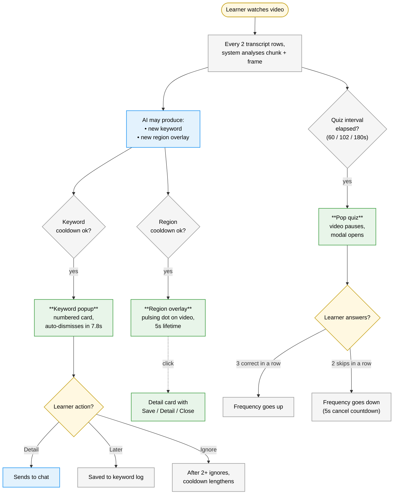
```mermaid
%% Three independent intervention pipelines, all gated by a shared
%% frequency setting (Low / Medium / High). Each has its own cooldown
%% and adaptive logic.
flowchart TD
    Watch(["Learner watches video"]):::user
    Tick["Every 2 transcript rows,<br/>system analyses chunk + frame"]:::sys
    Watch --> Tick

    Tick --> Out["AI may produce:<br/>• new keyword<br/>• new region overlay"]:::ai

    Out --> KW{"Keyword<br/>cooldown ok?"}:::sys
    KW -->|"yes"| Popup["**Keyword popup**<br/>numbered card,<br/>auto-dismisses in 7.8s"]:::ui
    Popup --> Choose{"Learner action?"}:::user
    Choose -->|"Detail"| Chat1["Sends to chat"]:::ai
    Choose -->|"Later"| Log["Saved to keyword log"]:::sys
    Choose -->|"Ignore"| Adapt["After 2+ ignores,<br/>cooldown lengthens"]:::sys

    Out --> RG{"Region<br/>cooldown ok?"}:::sys
    RG -->|"yes"| Dot["**Region overlay**<br/>pulsing dot on video,<br/>5s lifetime"]:::ui
    Dot -.->|"click"| Card["Detail card with<br/>Save / Detail / Close"]:::ui

    Tick --> QG{"Quiz interval<br/>elapsed?<br/>(60 / 102 / 180s)"}:::sys
    QG -->|"yes"| Quiz["**Pop quiz**<br/>video pauses,<br/>modal opens"]:::ui
    Quiz --> QA{"Learner answers?"}:::user
    QA -->|"3 correct in a row"| Up["Frequency goes up"]:::sys
    QA -->|"2 skips in a row"| Down["Frequency goes down<br/>(5s cancel countdown)"]:::sys

    classDef user fill:#fff8e1,stroke:#c8a420,stroke-width:1.5px,color:#000
    classDef ai fill:#e3f2fd,stroke:#2196f3,stroke-width:1.5px,color:#000
    classDef sys fill:#f5f5f5,stroke:#9e9e9e,stroke-width:1.5px,color:#000
    classDef ui fill:#e8f5e9,stroke:#43a047,stroke-width:1.5px,color:#000
```

## 2c.2 The frequency setting

A single Low / Medium / High control governs the pacing of every intervention. The learner can change it from the small pill toggles inside each feature card. The same setting also flows into the AI prompt: *Low* does not just delay regions, it tells the AI to be far more selective about emitting them at all.

| Setting | Time between keyword popups | Region cooldown | Time between pop quizzes | The instruction the AI receives |
|---|---|---|---|---|
| **Low** | 35 s base | 60 s | 180 s (3 min) | "Expect 0 regions per chunk; at most 1 across many chunks." |
| **Medium** | 20 s base | 40 s | 102 s (~1.7 min) | "Expect 0 or 1 per chunk." |
| **High** | 12 s base | 25 s | 60 s (1 min) | "Expect 0 or 1 per chunk, occasionally a second." |

In other words, lowering the frequency setting does not just *delay* interventions; it changes what the AI considers worth surfacing in the first place. This was important: a "Low" that simply throttled output would have produced the same low-quality material spaced further apart. Telling the AI to be choosier raises quality, not just rarity.

## 2c.3 What is on the screen

The base layout matches the other two prototypes (left rail, video and panels in the centre, chat on the right). What is different is the set of overlays:

- A **keyword popup card** appears in the bottom-right of the player when a new term is surfaced.
- **Pulsing markers** can appear directly on the video frame, drawing attention to specific elements.
- A **pop quiz modal** can pause playback at any time.
- A **keyword log panel** sits in the bottom-right corner of the screen, expandable, holding every keyword that has been shown so far.
- The two feature cards below the video (Explore Highlights, Pop Quiz) carry frequency pills and small *i* info-icons that explain what each card does.

<figure class="screenshot">
  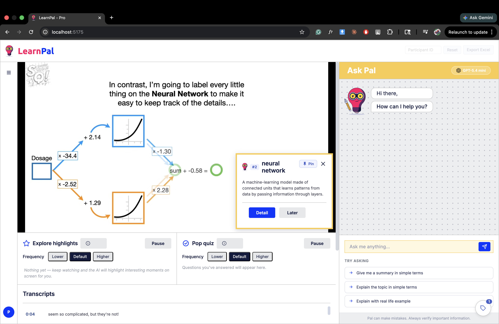
  <figcaption><strong>Screenshot 2c-A.</strong> A keyword popup in flight. The card sits over the bottom-right of the video, numbered (#1, #2…), with the term and a one-sentence definition. Three actions: Detail (sends to chat), Later (keep it in the log), or just let it auto-dismiss.</figcaption>
</figure>

<figure class="screenshot">
  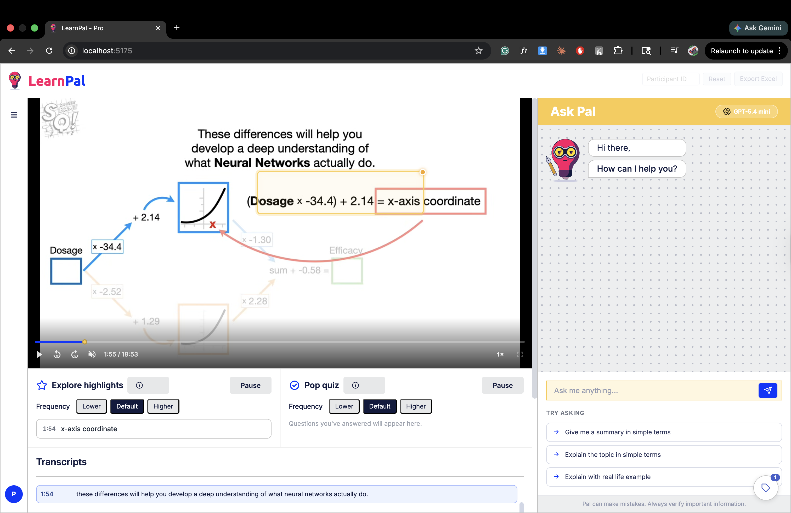
  <figcaption><strong>Screenshot 2c-B.</strong> A region overlay during its 5-second window. The pulsing marker draws attention to a specific element of the diagram, here a node, that the AI judged worth pointing out at this exact moment.</figcaption>
</figure>

<figure class="screenshot">
  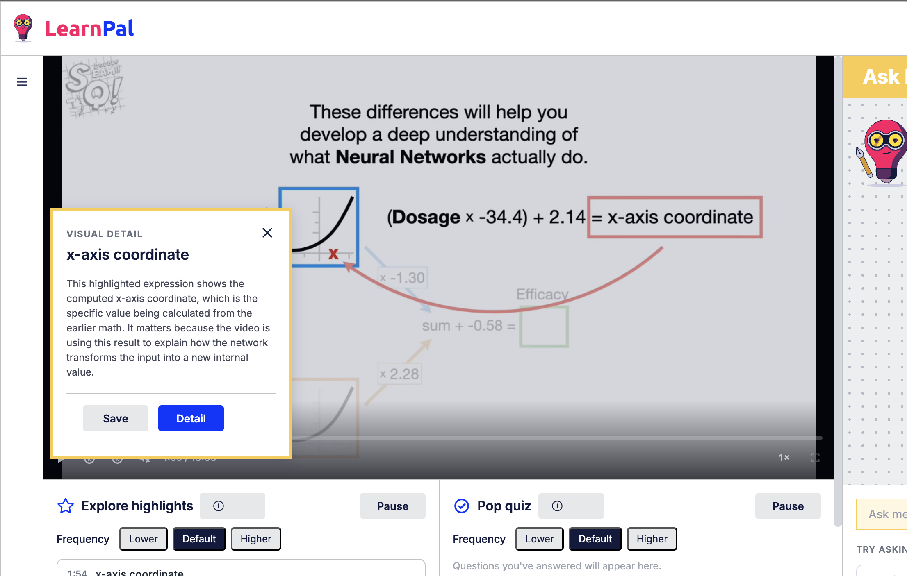
  <figcaption><strong>Screenshot 2c-C.</strong> Clicking a region overlay opens this detail card. Three actions: Save (keep it), Detail (route to chat for explanation), Close. The video stays paused while the card is open.</figcaption>
</figure>

<figure class="screenshot">
  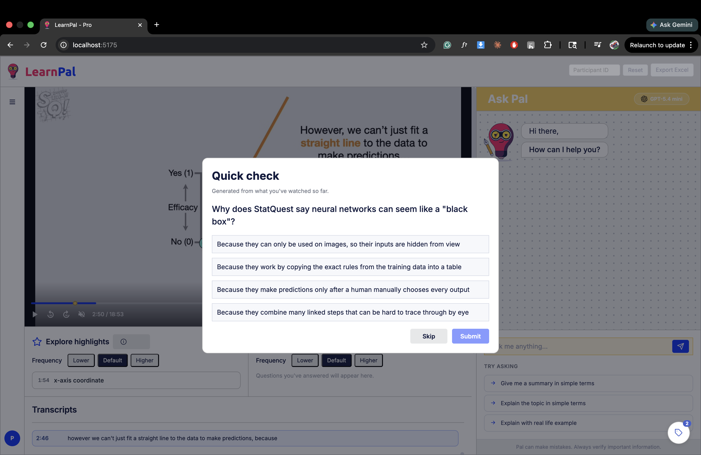
  <figcaption><strong>Screenshot 2c-D.</strong> A pop quiz mid-question. The frequency pill toggle is visible at the top right of the modal, so the learner can downgrade the rate without skipping. The video stays paused until the question is dismissed.</figcaption>
</figure>

<figure class="screenshot">
  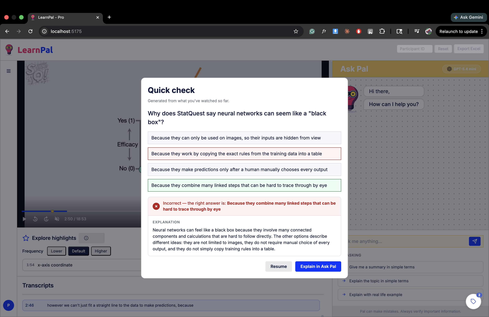
  <figcaption><strong>Screenshot 2c-E.</strong> The post-answer state. Correct or wrong is indicated visually; an explanation follows. From here the learner can ask Pal to explain in detail (which routes the question into chat) or close the modal and resume the video.</figcaption>
</figure>

<figure class="screenshot">
  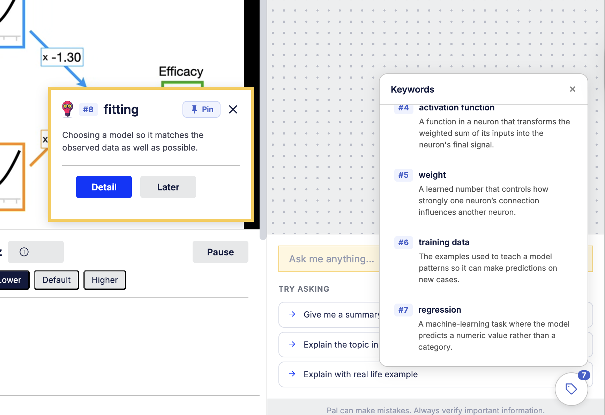
  <figcaption><strong>Screenshot 2c-F.</strong> The keyword log expanded. Every keyword that has been surfaced, taken from popups whether dismissed or not, accumulates here. Pinned keywords get an amber treatment and rise to the top.</figcaption>
</figure>

<figure class="screenshot">
  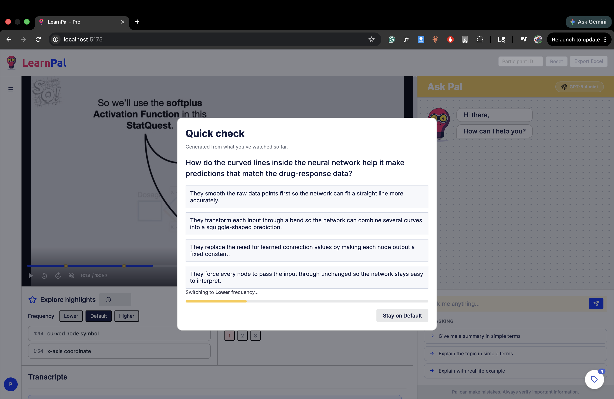
  <figcaption><strong>Screenshot 2c-G.</strong> The adaptive-frequency toast. After two skipped pop quizzes in a row, the system proposes to downgrade the frequency. A small countdown gives the learner five seconds to cancel, preserving agency without making them confirm explicitly.</figcaption>
</figure>

## 2c.4 The three intervention pipelines

Each intervention type has its own logic. They run independently of one another, but share a few cross-cutting safeguards.

### Keyword popups

When the analysis loop returns a new technical term, it goes into a queue. The system tries to show one popup at a time. A popup actually surfaces only when *all* of these conditions are met:

- The video is currently playing.
- No other intervention is on screen (no quiz open, no detail card, no other popup).
- Enough time has passed since the last popup. The gap is 12, 20, or 35 seconds depending on frequency, with up to 16 extra seconds added if the learner has been ignoring popups.
- The transcript is not currently *dense*, defined as more than 3.5 spoken words per second over the previous 12-second window. This stops popups from interrupting fast definitions.

If a popup does surface, it shows for 7.8 seconds and then fades. The learner has three options:

- **Detail** adds an explainer message to chat, with the keyword as context.
- **Later** keeps the keyword in the log without sending it to chat.
- **Ignore** lets the timer run out. After two consecutive ignores, the system extends the gap between popups by 16 seconds; this is the system inferring "keywords are not useful to this learner right now".

Every keyword that has ever surfaced, whether dismissed, sent to chat, or ignored, accumulates in the **keyword log** panel in the bottom-right corner. The learner can open it at any time and pin the entries they want to revisit.

### Region overlays

Regions arrive on the same analysis response as keywords, but they are gated separately. The AI returns coordinates for a region using a centre-based system (`cx`, `cy`, `width`, `height`, all as percentages of the video frame); the server normalises this to a top-left rectangle and clamps it inside the frame so a marker can never land off-screen.

A region surfaces only when no other intervention is active, the region cooldown has elapsed (25, 40, or 60 seconds depending on frequency), and the highlights feed is not paused. It lives for 5 seconds of *playback time*, so pausing the video pauses the timer, and seeking past the moment auto-dismisses the marker.

A click on the marker opens the detail card with three actions: Save, Detail (which routes to chat), and Close.

### Pop quizzes

The pop quiz is the heaviest intervention because it actually pauses the video. It is also the only one of the three that is **time-driven**, not content-driven. It fires when an interval elapses, not when the AI produces something new.

The interval depends on frequency (60, 102, or 180 seconds). On top of that, the quiz is held back if any of these are true:

- An intervention happened in the last 15 seconds (we do not want a keyword popup followed immediately by a quiz).
- The transcript is currently dense.
- The AI judges that the recent material is not substantive enough to support a meaningful question, in which case it returns a special `{"skip": true}` response and no quiz fires. The next attempt is scheduled sooner.

When a quiz does fire, the video pauses and the modal opens. The learner can answer (and see correct/wrong feedback with an explanation), or skip. Their pattern of responses then drives the **adaptive frequency**:

| What the learner is doing | What the system does | How it tells them |
|---|---|---|
| Answering 3 correctly in a row | Bumps the frequency up (Low → Medium → High) | A quick toast notification |
| Skipping 2 in a row | Bumps the frequency down (High → Medium → Low) | A toast with a 5-second cancel countdown |
| Answering wrong | Resets both streak counters | Nothing |

The auto-downgrade is reversible on purpose: a 5-second window with a *Stay on Medium* button lets the learner override the system's interpretation of their behaviour. This preserves their agency without forcing them to confirm anything when they do not want to. Whether they cancel or accept the downgrade is itself a logged event, and a good signal for the analysis.

## 2c.5 What the chat knows about everything else

The Proactive chat, like the Continuous chat, is informed by everything the AI has surfaced in this session, but the list is different. It includes:

- The last six lines of transcript (current context).
- The participant's quiz history (so the AI can address misconceptions directly).
- Up to ten recent surfaced keywords (so the chat does not redefine them).
- Up to five recent surfaced regions (so a follow-up question about "that diagram" makes sense).

The same context is also fed back into the analysis loop, so the AI does not waste a keyword slot on something the participant just asked Pal about.

## 2c.6 Two pieces of prompt engineering worth highlighting

The Proactive prototype's prompts contain two ideas that generalise well beyond this project.

### The "12-year-old rule"

In early pilots, the AI cheerfully promoted words like "graph", "curve", and even the StatQuest video's surface-level analogies ("dosage", "efficacy") to glossary status. None of these are technical terms. The fix was a simple addition to the prompt:

> *If a smart 12-year-old already knows what the word means in everyday English, it is NOT a glossary term, even if the speaker just used it. Only surface terms whose technical meaning is non-obvious from common usage.*

That rule, plus a server-side blocklist of about thirty common offenders, suppressed the bad keywords almost entirely. It is a reminder that AI prompts often need to be told what *not* to do as explicitly as what to do.

### Region strictness, parameterised by frequency

The same chunk of transcript, with the same frame, can produce zero region overlays at the **Low** setting and one region at **High**, *without changing any client-side logic*. The trick is that the strictness phrasing is interpolated into the AI prompt itself based on the current setting:

> **Low.** "Only emit a region when pausing playback to look at this exact area would meaningfully change the learner's understanding right now. Default to []. When in doubt, return []."
>
> **Medium.** "Emit a region only when a specific on-screen element is the focal point of the current explanation AND the learner would clearly benefit from the system pointing it out. When in doubt, return []."
>
> **High.** "Emit a region when a specific element on screen is being actively referenced and pointing it out would help the learner. Still skip transitional, decorative, or speaker-only frames."

This means lowering frequency genuinely raises the bar for what counts as a worthwhile interruption, rather than just delaying the same low-quality candidates.

## 2c.7 What is happening in the code

The Proactive client tracks more state than either of the other prototypes, because each of the three intervention pipelines has its own pacing logic, its own cooldowns, and its own adaptive counters.

| Variable / ref | What it tracks |
|---|---|
| `liveKeywords`, `liveKeywordsRef` | The queue of keywords waiting to be shown |
| `keywordLog` | The persistent numbered log in the corner panel |
| `activeKeywordPrompt` | The popup currently visible on screen |
| `frameRegions` | Region overlays currently being drawn |
| `surfacedHighlightsRef` | Every region ever shown (used for dedup and chat context) |
| `activeQuiz`, `quizSelection`, `quizOutcome`, `quizHistory` | The pop quiz modal's state and history |
| `consecutiveSkips`, `consecutiveAnswered` | The streak counters that drive adaptive frequency |
| `quizFrequency`, `selectedFrequency` | The current setting (quiz and visual frequency are independent) |
| `quizPaused`, `highlightsPaused` | Per-feature pause states |
| `freqDownCountdown` | The 5-second cancel window for auto-downgrades |
| `lastQuizAt`, `lastVisualNudgeAtRef`, `lastAnalysedRowRef` | Pacing refs |

The pattern of "state for re-rendering, ref for stale-free reads from a long-lived callback" recurs many times here. It is the price of having a background loop that needs to read the current state of half a dozen pacing counters every few seconds.

## 2c.8 Events that are unique to this prototype

Proactive logs the largest event vocabulary of the three prototypes:

| Event | When it fires | What it tells us |
|---|---|---|
| `keyword_shown` | A popup appears | The system surfaced a keyword. |
| `keyword_ignored` | The 7.8-second timer ran out without action | The participant did not engage. |
| `keyword_dismissed` | They explicitly closed the popup | An active rejection. |
| `keyword_later` | They clicked Later | Deferred but not rejected. |
| `keyword_pinned` | They pinned a keyword in the log | Strong engagement with that term. |
| `keyword_detail` | They clicked Detail (routes to chat) | Strong engagement, conversational. |
| `visual_opened` | They clicked a region overlay | Engagement with a region. |
| `visual_saved` / `visual_detail` / `visual_closed` | The three actions in the detail card | Granularity of what they did with it. |
| `quiz_triggered` | A pop quiz fired | The system attempted a quiz. |
| `quiz_correct` / `quiz_wrong` / `quiz_skipped` / `quiz_detail` | The quiz interaction outcomes | Standard quiz signals. |
| `frequency_changed` | Manual or automatic frequency change | Tells us when the participant adjusted (and when the system did). |
| `highlights_paused` / `highlights_resumed` | Pause toggle on the highlights feed | Selective regulation behaviour. |

In the export, "AI suggestions shown" is the sum of `keyword_shown + quiz_triggered + visual_opened`. "AI suggestions accepted" is `keyword_detail + quiz_correct + quiz_wrong + visual_detail + visual_saved`. "AI suggestions rejected" is `keyword_dismissed + keyword_ignored + quiz_skipped + visual_closed`. The ratio of accepted to shown is the participant's **acceptance rate** for a paradigm where AI initiative produced every one of those moments, a signal that the other two prototypes cannot produce in quite the same way.

## 2c.9 The design decisions worth flagging

- **Three independent pipelines.** Keywords and regions share a cooldown (so they do not collide), but quizzes have their own. This prevents the worst failure mode (everything firing at once) while still allowing the second-worst (a keyword popup followed by a quiz 15 seconds later, which is actually fine in practice because the participant has time to read the popup and prepare for the quiz).
- **Adaptive frequency is reversible.** The 5-second cancel countdown is small but important; it gives the learner the last word without requiring them to confirm every system-initiated change. Whether they accept or cancel is a useful signal in its own right.
- **The keyword log lives in a corner, not in the chat sidebar.** Keeping the keyword log separate from the chat preserves the conceptual distinction: keywords are *interruptions* (system-initiated), chat is *deliberate help-seeking* (learner-initiated). Mixing them would have blurred this.
- **The density check.** This was added after pilot transcripts containing rapid-fire definitions ("a neuron, a layer, an activation, a weight") triggered popups mid-sentence. The threshold (3.5 spoken words per second over 12 seconds) is conservative; the trade-off is that some legitimate moments are also skipped. The cost of false-positive popups was judged higher than the cost of missed surfacing.
- **Frequency strictness is in the prompt, not the client.** This is worth restating. The same code, the same data, with a different setting, produces genuinely different content because the AI's emission policy itself changes. This is what makes Low feel calm rather than just slow.

## 2c.10 What this prototype cannot do

- The frequency setting only logs *when* a learner changes it, not *why*. A free-text rationale would be richer but would also add friction; the friction was judged not worth it for a study setup.
- The region coordinate system assumes the video is rendered at full visible resolution. If the player is letterboxed or scaled, the marker can land slightly off-target. We have not seen this in practice with the local 1080p MP4, but it is theoretically possible.
- Like Continuous, Proactive depends on local-video frame capture; YouTube embeds cannot be canvas-read.
- The pop-quiz skip gate (`{"skip": true}`) trusts the AI's self-assessment of content quality. When the AI is wrong about that, the participant does not see a quiz they could have benefited from. There is no fallback; this is an honest limitation.
- There is no learner model. Adaptive frequency is reactive (skips and correct streaks) rather than diagnostic (which concepts is this learner weak on). Concept-level adaptivity would be a natural next step.


---

# Section 3: Putting the Three Side by Side

Now that each prototype has been described on its own terms, this section pulls them into a single view. The goal is to make the three positions in the design space visible at a glance, and to show how the same idea (a quiz, say, or a "highlight") shows up differently in each.

## 3.1 The three positions in one sentence each

| Prototype | The position it takes |
|---|---|
| **Intermittent** | *Help is always available, but it never speaks. The learner has to invoke it.* |
| **Continuous** | *Help is always visible in the periphery. The learner samples what they want.* |
| **Proactive** | *Help captures attention deliberately. The learner can override the system, but the system pushes.* |

These three sentences are also the three competing hypotheses the user study tests against one another.

## 3.2 The defining differences, side by side

Most of the underlying machinery is shared. The genuine differences are concentrated in a small set of design decisions, summarised below.

| Question | Intermittent | Continuous | Proactive |
|---|---|---|---|
| Does the AI speak first? | Never | Yes, in side panels, ambient | Yes, through popups, overlays, quizzes |
| Does anything ever interrupt the learner? | No | No (only animations on entry) | Yes, pop quizzes pause the video |
| Is there a background analysis loop? | No | Yes, every 4 transcript rows | Yes, every 2 transcript rows |
| Does the learner crop frames manually? | Yes (the Snap feature) | No | No |
| Are there persistent feeds in the UI? | None | Glossary, highlights, questions | Keyword log; the rest are transient |
| Is there a frequency setting? | n/a | n/a | Yes, Low / Medium / High |
| Does the AI tune its own pacing? | No | No | Yes, auto up/down from learner behaviour |
| What is the largest source of complexity? | The snap-to-ask flow | The accumulating side panels | The three intervention pipelines |

## 3.3 The same idea, three different shapes

It is worth tracing how a single concept, for example "quiz", actually appears across the three prototypes. The idea is the same, but the shape it takes is quite different.

| Concept | In Intermittent | In Continuous | In Proactive |
|---|---|---|---|
| **A quiz question** | Lives in a modal that opens only when the learner clicks *Start Quiz*. They control when. | Surfaces in a side feed automatically as the AI sees fit, paced by a 100-second timer. They can choose to engage. | Pauses the video and demands attention through a modal. Frequency adapts to behaviour. |
| **A glossary term** | (No equivalent feature.) | Slides into a panel quietly; persists until removed. | Bursts into a popup card for 7.8 s; auto-dismisses if ignored; ends up in a corner log. |
| **A visual cue on the frame** | Done manually by cropping a region with Snap. | Brief animated marker dots, ~4 s lifetime. | Pulsing amber overlays with a click-to-expand detail card. |
| **Asking about an image** | The defining feature: capture a screen region and send it to chat with a question. | (No equivalent feature.) | Possible via the region detail card's *Detail* button, which routes to chat. |
| **Asking the AI a free-form question** | Always available in the chat sidebar. | Always available; the AI is informed by the surfaced panels. | Always available; the AI is informed by the keyword log and region history. |

## 3.4 Mapping each prototype onto ICAP

The user study analyses engagement using the **ICAP** framework (Passive → Active → Constructive → Interactive). The intuition is straightforward: higher rungs are associated with deeper learning. *Passive* is just watching; *Active* is doing something with what is watched (pausing, seeking, scrolling the transcript); *Constructive* is producing content of one's own (asking a question, answering a quiz); *Interactive* is genuine back-and-forth dialogue.

The same behaviours do not always exist in all three prototypes, so each one's events bucket slightly differently. The table below shows the same rungs, populated with what each paradigm offers.

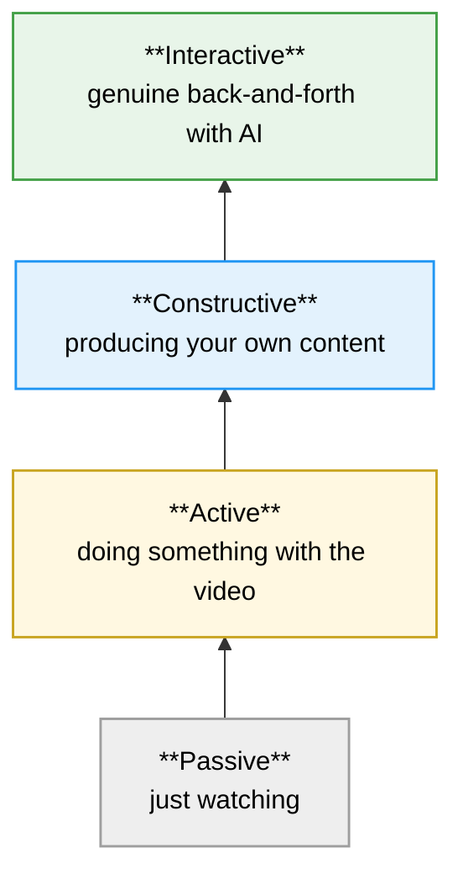
```mermaid
%% The four ICAP rungs, with examples of what each looks like in each prototype.
flowchart BT
    P["**Passive**<br/>just watching"]:::passive
    A["**Active**<br/>doing something with the video"]:::active
    C["**Constructive**<br/>producing your own content"]:::constructive
    I["**Interactive**<br/>genuine back-and-forth with AI"]:::interactive

    P --> A --> C --> I

    classDef passive fill:#eeeeee,stroke:#9e9e9e,color:#000,stroke-width:1.5px
    classDef active fill:#fff8e1,stroke:#c8a420,color:#000,stroke-width:1.5px
    classDef constructive fill:#e3f2fd,stroke:#2196f3,color:#000,stroke-width:1.5px
    classDef interactive fill:#e8f5e9,stroke:#43a047,color:#000,stroke-width:1.5px
```

| Rung | Intermittent | Continuous | Proactive |
|---|---|---|---|
| Passive | Default baseline (just watching) | Default baseline | Default baseline |
| **Active** | Pause, seek, transcript click | Pause, seek, transcript click, glossary click | Pause, seek, transcript click, keyword pin |
| **Constructive** | Chat message, snap-to-ask, quiz answer | Chat message, feed-question answer, highlight detail, explain-answer | Chat message, pop-quiz answer, keyword detail, region detail |
| **Interactive** | Multi-turn chat after a snap or quiz | Chat that builds on already-surfaced terms or questions | Chat that follows from a keyword popup, region card, or quiz prompt |

The analytical question this sets up is straightforward: does AI initiative push engagement up the ICAP rungs? If the Continuous and Proactive prototypes show higher constructive and interactive event counts than Intermittent for the same total session time, that is evidence that initiative-driven content is producing richer engagement, not just more interaction.

## 3.5 How "AI suggestion shown" means three different things

The export sheet reports three counters that exist in all three prototypes (`ai_suggestions_shown`, `ai_suggestions_accepted`, `ai_suggestions_rejected`), and the ratio between them gives an *acceptance rate* per participant. But what counts as a "suggestion shown" is paradigm-specific:

| Counter | In Intermittent, this means... | In Continuous, this means... | In Proactive, this means... |
|---|---|---|---|
| Suggestions **shown** | the participant chose to invoke a suggestion (started a quiz) | the system put a suggestion on screen automatically | the system actively interrupted the participant |
| Suggestions **accepted** | they finished what they started | they engaged with the surfaced content | they engaged with the interruption |
| Suggestions **rejected** | they skipped the modal | they paused the feed or skipped a question | they ignored, dismissed, or skipped an intervention |

These three readings of the same number are exactly what makes the cross-paradigm acceptance rate interesting:

- An **Intermittent** acceptance rate measures *follow-through on a self-initiated request*. It is a property of the learner's discipline.
- A **Continuous** acceptance rate measures *whether passive presence translates to action*. It is a property of how attractive the feeds are.
- A **Proactive** acceptance rate measures *whether interruption produces engagement*. It is a property of how well the system's timing matches the learner's needs.

Each of these is a different question. None of them is more valid than the others. They are testing different things, and that is the point of having three prototypes.

## 3.6 Where each design lives in the agency spectrum

The three prototypes can also be placed on a spectrum of who is in charge of when AI shows up.

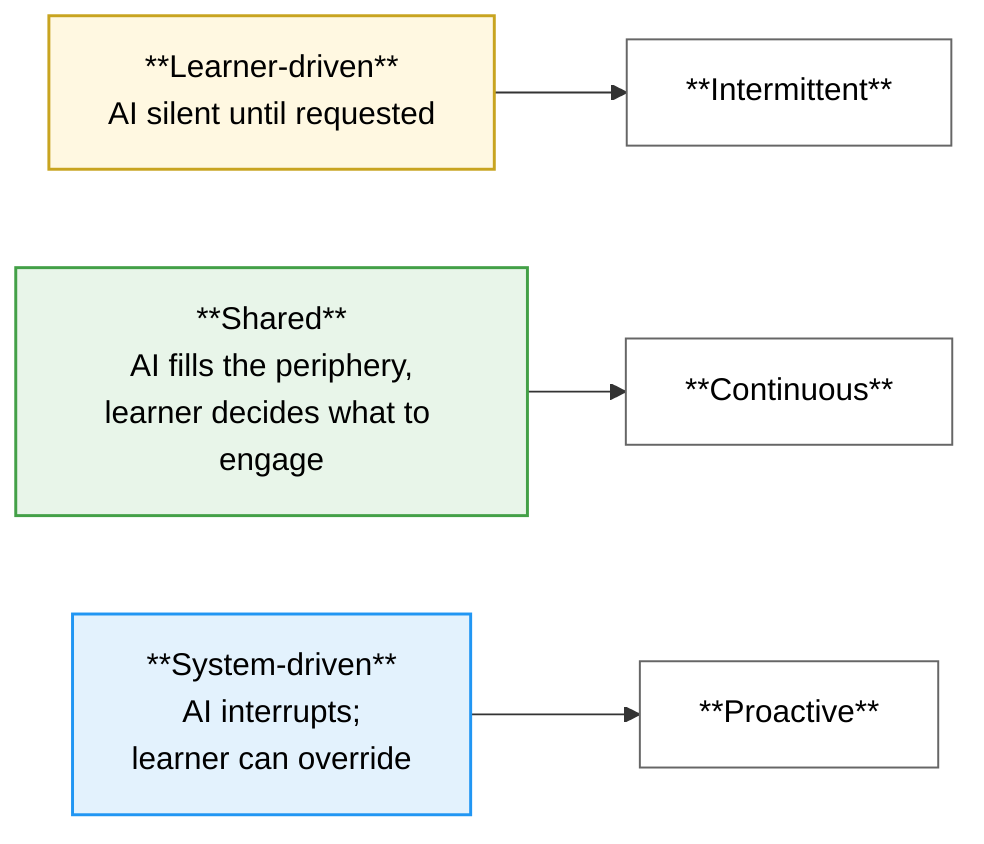
```mermaid
%% A spectrum from full learner agency (left) to full system agency (right).
flowchart LR
    L["**Learner-driven**<br/>AI silent until requested"]:::user
    M["**Shared**<br/>AI fills the periphery,<br/>learner decides what to engage"]:::shared
    R["**System-driven**<br/>AI interrupts;<br/>learner can override"]:::system

    L --> Inter["**Intermittent**"]:::label
    M --> Cont["**Continuous**"]:::label
    R --> Pro["**Proactive**"]:::label

    classDef user fill:#fff8e1,stroke:#c8a420,color:#000,stroke-width:1.5px
    classDef shared fill:#e8f5e9,stroke:#43a047,color:#000,stroke-width:1.5px
    classDef system fill:#e3f2fd,stroke:#2196f3,color:#000,stroke-width:1.5px
    classDef label fill:#fff,stroke:#666,color:#000,stroke-width:1px
```

The leftmost position trusts the learner to know when they need help. The rightmost position trusts the system to know when intervention helps. The middle position tries to give both: content always available, never demanded.

What the user study is ultimately trying to find out is: for which kinds of learner, on which kinds of content, does each position produce the best learning? None of the three prototypes is obviously better than the others; the comparison is the design contribution.


---

# Section 4: Implementation Rationale, Trade-offs, and Limitations

This final section steps back from the prototypes themselves to discuss the choices behind them: what was deliberately accepted as a trade-off, and where the design has known limitations. Many of the most consequential decisions in a design project are not visible in the artefact itself, and they are documented here for completeness.

## 4.1 Why three apps instead of one with toggles

The most obvious alternative architecture would have been a single application with a setting that changes its behaviour. Three separate apps were built instead, for three reasons.

**It removes contamination.** A toggle would let participants flip mid-session, producing data points that are mixtures of paradigms. Three separate apps make the condition a fixed property of the deployment; once a participant lands on Continuous, they stay on Continuous.

**It makes the design claims visible in the code.** Intermittent has no `/api/analyse` route at all; its codebase is genuinely smaller. The architectural claim ("Intermittent has no background AI loop") is concrete in the file system rather than parameterised away.

**It allowed the three to evolve independently.** During pilot work, each prototype needed different fixes. The anti-recall quiz prompt landed in all three. The keyword blocklist landed in Continuous and Proactive only. Region strictness only matters in Proactive. Separate repositories let each fix land without re-validating the other two.

The cost is real code duplication: chat, quiz, sessions, events, export, and the participant modal flow are nearly identical across all three. Duplication was chosen over premature abstraction because these are study artefacts, not a product. If a single paradigm wins clearly in the user study, the next iteration would consolidate them.

## 4.2 Holding everything else constant

To isolate the paradigm as the variable actually being tested, everything else was kept constant.

| What was held constant | Why |
|---|---|
| Same video (StatQuest, *The Essential Main Ideas of Neural Networks*, ~17 min) | Different videos would mean different content density, different visual style, different speaking pace, all confounds. |
| Same transcript (static `.json` file) | Removes any variance from live transcription quality. |
| Same set of AI providers, same default | The provider's behaviour should not be a hidden variable in the comparison. |
| Same token caps, same JSON-mode flags | Aligned where the provider supports them. |
| Same English-only setup | Language-handling differences would dominate the data. |

Anything different that the participants experience, including different engagement and different learning outcomes, can therefore be attributed to the paradigm itself, not to model quality, content, or production values.

## 4.3 The little things that turn out to matter

Three small details, each of which broke the data in early pilots, are worth flagging because they would be easy to miss when reading the code.

**Skipping the participant modal must NOT create a session.** In the first pilot, sessions were saved with `participant_id = NULL` whenever the modal was dismissed during testing. The fix was to introduce a separate state, *modal dismissed*, that prevents session creation while still letting the UI be explored.

**Reset must NOT immediately create a new session.** When a Reset button was added, it eagerly created the next participant's session right away. This produced two awkward effects: a row in the database for every reset performed in testing, and occasional double-rows for the same participant. The fix was to make Reset return to the modal state and only create a session on confirmation.

**`first_interaction` must fire exactly once.** The earliest version logged a "first interaction" event on incidental things, like the first transcript scroll. The gate was tightened to fire only on the first deliberate engagement (first quiz, first chat, first snap), and to suppress all subsequent firings.

These are small bugs, but each of them would have invalidated some measurements if not caught early. They are documented here because they are the kind of decision that would otherwise have to be reconstructed from `git log`.

## 4.4 Why the local MP4

An earlier version of all three prototypes used the YouTube embedded player. Two problems pushed the design off it.

**Frame capture is impossible.** The two prototypes that need to send video frames to the AI (Continuous and Proactive) need to read pixels from the video element. YouTube's embedded player blocks this for security reasons. Without frame capture, the on-screen region overlays in Proactive disappear entirely, and the equivalent feature in Continuous degrades from "look here" markers to text-only highlights.

**Reliability.** The video occasionally returned "Video unavailable" mid-session for reasons outside our control. The participant's session would just freeze. Switching to a local MP4 file removes this entirely.

The trade-off is asset weight: the MP4 is gitignored and has to be present on the local machine. The deployment instructions for the study include a one-line copy step.

## 4.5 Why fullscreen is disabled

The side panels (chat, glossary, highlights, question feed, keyword log) are *the paradigm*. A participant who watches the video full-screen has effectively collapsed every prototype into the same Passive-ICAP experience, and the paradigm distinction is lost in the data. Disabling fullscreen with an explanatory tooltip preserves the comparison.

This is a study-design choice, not a technical limitation. A real product built on any single paradigm would re-enable fullscreen.

## 4.6 The trade-offs knowingly accepted

| Choice | Trade-off |
|---|---|
| LLM-only generation, not curated content | Better generalisation to other videos at the cost of occasional weak items. Mitigated by blocklists, dedup, and the anti-recall rule. |
| One video for the whole study | Strong internal validity, but the paradigm differences cannot be claimed to generalise. |
| English only | Avoids transcription quality variance, but excludes non-English speakers entirely. |
| No learner model | Adaptive behaviour is reactive (skip / correct streaks), not diagnostic (concept mastery). |
| Chat context capped at 4 messages × 120 chars | Bounds the analysis prompt size, but loses long conversational threads. |
| Three identical SQLite databases | Trivial deployment, but cross-prototype joins have to happen at export time. |
| Excel export, not a researcher dashboard | The researcher uses their preferred tool; no UI to maintain. |

## 4.7 Honest limitations

A few things are worth being upfront about.

**The sample size is small.** At the current data snapshot, the study includes a small number of participants per condition. Statistical claims will be limited; qualitative analysis carries most of the weight while data collection continues.

**Self-paced sessions vary in length.** Some participants watched the full 17 minutes; others paused frequently. Active-watching time is logged, but session length is not normalised.

**No eye-tracking.** The instrumentation captures clicks, keystrokes, and answers, not attention. "Ignored" is a count of expired keyword popups, not a measurement of where the eyes were.

**The frequency setting in Proactive may interact with prior expectations.** A participant told to use "Medium" may anchor differently from one who experiments. The effect of the setting cannot be fully separated from the effect of being told about it.

**Same researcher administered every session.** Order effects, demand characteristics, and verbal cuing are possible.

**The transcript is fixed.** Real-world video lectures vary in pace, density, and clarity. A single video does not tell us whether the paradigm differences generalise across content types.

**The AI is non-deterministic.** Two participants in the same condition do not see exactly the same content. The blocklists and dedup rules reduce this to a tolerable level, but it is not zero.

## 4.8 What was deliberately left out

A few things were on the table and were intentionally not included, to keep the comparison clean.

- **Voice input or output.** TTS quality and audio overlap with the video would have introduced too many confounds.
- **Pre-test gating on prior knowledge.** Everyone sees the same prompts regardless of background.
- **Group or shared sessions.** No multi-user features, no shared annotations.
- **Mobile UI.** Desktop only; the chat sidebar is hidden below 1280 pixels of viewport width.
- **Cross-session memory.** Each session is a fresh start.
- **Difficulty propagation between Continuous's two quiz paths.** The legacy modal quiz and the live feed quiz keep separate difficulty state.

Each of these was a deliberate scoping decision rather than an oversight.

## 4.9 The public deployment

The same three prototypes are also deployed to a public URL ([learn-pal-demos.vercel.app](https://learn-pal-demos.vercel.app/)) so that they can be tried without the researcher being present. The deployed build is the same code as the study build, with three deliberate differences: (i) the participant-ID modal is auto-skipped, (ii) the researcher panel (Reset and Export buttons) is hidden, and (iii) no events, sessions, or messages are written to a database — every logging call is short-circuited by the same guard that prevents writes when no participant ID is set. The public deployment is therefore safe to share without contaminating the real study data.

Three small operational notes follow from this. The video file is served from a public mirror on the Internet Archive rather than from the local `public/` folder, because the archive supports the cross-origin headers that the Continuous and Proactive prototypes need for canvas-based frame capture. The free-tier hosting spins down after fifteen minutes of inactivity, so the first request after a quiet period takes around thirty seconds to wake the server. And each prototype has its own `deploy/demo` git branch, kept in lock-step with `main` plus the demo-mode flag — this isolation guarantees that improvements made for the public deployment cannot accidentally land in the study build.
