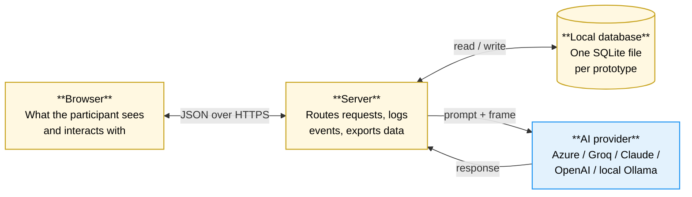
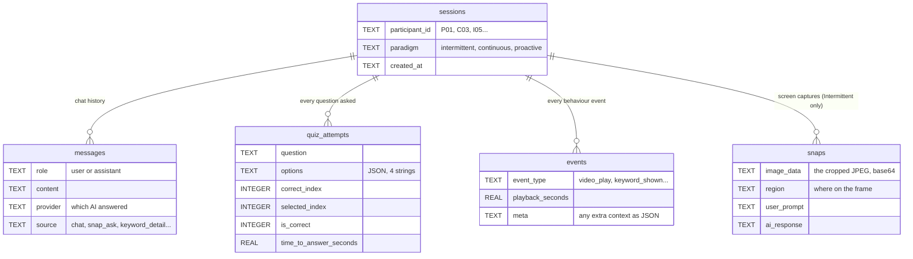

# Section 1: The Shared Foundation

> **Try the prototypes:** all three are deployed and accessible at **[learn-pal-demos.vercel.app](https://learn-pal-demos.vercel.app/)**. The three cards on that page open the Intermittent, Continuous, and Proactive versions respectively. The first load of each may take ~30 seconds while the free-tier service warms up; subsequent navigation is instant. The deployed versions match the study build, with the participant-tracking instrumentation disabled (see §4.9).

Before describing the three prototypes individually, this section walks through what they have in common. All three are built on the same technical base, with the same data model, the same instrumentation, and the same set of safeguards around the AI's output. Only one route on the server, and the on-screen panels themselves, actually differ between them. Isolating the shared parts here first allows the per-prototype sections to stay focused on what makes each design distinctive.

A reader who reads only this section should walk away with a clear picture of three things: how the apps are structured, how a study session flows from open-the-page to export-the-data, and what guardrails are in place so that the AI does not undermine the comparison.

## 1.1 What sits behind the screen

Every prototype is a small web application. The participant opens it in a browser; behind the scenes, three things are at work.

1. A **frontend** written in React. This is the visible interface, including the video player, the chat sidebar, and the panels and overlays that vary by paradigm.
2. A **backend** written in Node.js (using Express). This handles five kinds of request: chat messages, quiz generation, transcript-chunk analysis, behaviour event logging, and data export.
3. A **local SQLite database file** that stores everything for the session.

These three pieces talk to one or more **AI providers** over the internet, or to a local model running on the same machine where one is available. Whichever provider is selected, the prompts and the response handling are identical. Only the message format differs slightly between vendors.

The stack was deliberately kept small. There is no hosting, no authentication, and no cloud database. Every prototype runs on a researcher's laptop. That choice traded production-level infrastructure for rapid modification during pilot testing, which mattered far more in practice.

## 1.2 The technology choices, briefly explained

| What | Choice | Why |
|---|---|---|
| Frontend framework | React + Vite | React allows complex, stateful interfaces to be built without re-inventing patterns; Vite keeps the development loop nearly instant. |
| Video player | The browser's own `<video>` element | YouTube's embedded player blocks the kind of frame-grabbing the AI needs. A local MP4 file gives full control. |
| Backend | Node.js with Express | The simplest possible HTTP server. A new route can be added in two minutes. |
| Database | SQLite (single file) | No database server to install or configure. The whole study's data sits in a single, easily portable file. |
| AI calls | Plain HTTP fetch to each provider | No SDK lock-in. Providers can be swapped in the UI by changing a single variable. |
| Export | Multi-sheet Excel and CSV | The researcher opens it in whatever tool they prefer (Excel, R, Python). |

### The AI providers

The same six providers are wired into all three prototypes. The participant's session uses whichever one is currently selected; switching is logged as a `provider_switched` event so we know exactly which model produced which response.

| Provider key | Model behind it | Can it look at images? | Notes |
|---|---|---|---|
| `azure` | GPT-4o mini (Azure-hosted) | yes | The default during the study. |
| `azure-54` | GPT-5.4 mini (Azure-hosted) | yes | A second slot, kept available for comparison runs. |
| `groq` | Llama 3.3 70B | text only | Low-latency text-only fallback, used when no frame is being sent. |
| `claude` | Claude Sonnet 4.6 | yes | Anthropic's API, used in fallback runs. |
| `openai` | GPT-4o | yes | Standard OpenAI endpoint. |
| `ollama` | Llama 3.2 (local) | depends on model | A local fallback for offline testing. |

## 1.3 How a study session actually unfolds

The participant does not think about any of this infrastructure. From their perspective, a session is six steps long.

1. **They land on the page.** A modal asks for a participant ID (`P03`, `C04`, `I05`...). They cannot interact with anything else until they enter one or click *Skip for testing*. Skipping does **not** create a database record, so test runs do not pollute the real participant data.
2. **The session begins.** As soon as a real ID is entered, the app sends a single message to the server: "create a session for participant P03 in the Proactive condition". The server replies with an ID. From that moment on, every chat message, every quiz answer, and every click is tagged with that ID.
3. **They watch the video.** The same 17-minute video plays in every prototype. The transcript scrolls alongside the video. They can pause, seek, and change playback speed.
4. **They interact with the AI**, in whichever way the prototype allows. (This is the point of the comparison; how this step looks is exactly what differs between the three designs.)
5. **They reach the end**, either by playing through, or because the session is complete. The researcher can hit a *Reset* button to clear the screen for the next participant; the previous data stays safe in the database.
6. **The researcher exports the data.** A single button downloads a multi-sheet Excel file containing every session's events, messages, and quizzes for analysis.

Several small details in this flow (in particular the careful separation of "ID entered" from "session created", and what *Reset* should and should not do) were tightened only after the first pilots exposed bugs in the data. The full story is in §4.3.

## 1.4 What the database actually stores

Every prototype writes to the same five tables. The database file is local to that prototype's server, but the structure is identical.

The simplest way to think about this: `sessions` is the participant's run; the other four tables are the things that happened *during* that run. Chat goes to `messages`, quiz answers to `quiz_attempts`, all the rest goes to `events`. The `snaps` table is only really used in the Intermittent prototype, where the participant manually crops a region of the video to ask about; in the other two it sits empty.

## 1.5 What is logged, and why

There are two streams of data. The **content stream** lives in `messages` and `quiz_attempts`, and captures *what* the participant said and *what* the AI replied. The **behaviour stream** lives in `events`, and captures *what they did* and *when*.

The behaviour stream is the more interesting one for the comparison, because it lets us reconstruct the rhythm of a session second by second. Some events are shared by all three prototypes:

| What happened | Event name | Why it matters |
|---|---|---|
| Participant pauses the video | `video_pause` | A signal of effort; participants who pause more often are working harder. |
| Participant seeks (jumps to a different part) | `video_seek` | Indicates re-watching, often after confusion. |
| Participant clicks a transcript line | `transcript_clicked` | Shows the transcript is being used as a navigation tool. |
| Participant changes playback speed | `playback_speed_changed` | Speeding up suggests boredom or familiarity; slowing down suggests struggle. |
| Tab loses or gains focus | `tab_blurred` / `tab_focused` | A proxy for whether the participant is paying attention. |
| Participant sends a chat message | `chat_message_sent` | Constructive engagement: producing content, not just consuming it. |
| Participant changes AI provider | `provider_switched` | Useful for investigating model effects on behaviour. |
| The browser tab is closing | `session_end` | Recorded via `sendBeacon` so the final video position is captured even on crash. |

Each prototype adds its own paradigm-specific events on top of this base. Those are listed in their respective sections.

### The Excel export

When the researcher hits *Export*, they receive a single `.xlsx` file with five sheets:

| Sheet | One row per | Contains |
|---|---|---|
| **Comparable** | Session | Aggregate metrics designed for cross-paradigm comparison (engagement counts, quiz accuracy, ICAP buckets) |
| **Messages** | Chat message | Provider, source tag, role, full content |
| **Quizzes** | Quiz attempt | Question, options, what was selected, time to answer |
| **Snaps** | Snap | Timestamp, region, user prompt (image data is excluded to keep the file small) |
| **Events** | Logged event | The full behaviour stream |

The *Comparable* sheet is the one that does the heavy lifting for analysis. It groups raw events into ICAP buckets: Active behaviour (pausing, seeking, transcript-reading), Constructive behaviour (asking questions, answering quizzes), and Interactive behaviour (back-and-forth dialogue with the AI). It also computes an "AI acceptance rate": of all the AI suggestions the participant saw, what fraction did they actually engage with?

The exact bucketing is paradigm-specific. What counts as a "suggestion shown" looks different in a paradigm where the AI never speaks unprompted, compared to one where it interrupts on a schedule. The comparison section (§3) explains how these differences map to one another.

## 1.6 Keeping the AI honest

Generative AI is helpful but unreliable. Given the chance, it will repeat itself, anchor on the first answer choice in its prompt, surface things that are not really technical concepts, and write quiz questions that test memorisation rather than understanding. The shared safeguards below are what stop these tendencies from breaking the study.

**Shuffled answer options.** Whenever a quiz question is generated, the four answer options are shuffled on the server before being sent to the participant. Without this, the AI overwhelmingly placed the correct answer at position A, anchored by the JSON example in the prompt. The entire study would then have measured "can the participant click the first option" rather than learning. After this was noticed in pilots, the shuffle made the answer position genuinely random.

**An explicit anti-recall rule in the quiz prompt.** Every quiz prompt forbids verbatim recall and demands that the wrong answers be plausible misconceptions of similar length and structure. The same wording is used in all three prototypes so quiz quality stays constant when comparing learning outcomes.

**A JSON repair step.** AI responses are supposed to be valid JSON. They sometimes are not (a missing comma, an unquoted key). Rather than failing silently, the server runs a small repair pass that recovers most malformed responses. This rescued roughly five percent of pilot calls.

**Cross-feature awareness.** When the participant asks the chat a question, the system prompt includes everything the AI has already shown them in this session: past quiz questions, glossary terms, and highlights. That way, the chat does not redefine concepts the participant has already seen, and it does not ignore the rest of the experience. The same context is fed back into the analysis call (in the two prototypes that have one), so the AI does not waste a glossary slot on a term the participant just asked about in chat.

## 1.7 What is actually different between the three prototypes

After all of the above, the genuine differences come down to a handful of things. Everything else is shared.

| Aspect | Intermittent | Continuous | Proactive |
|---|---|---|---|
| Does the AI speak without being asked? | No, never | Yes, fills side panels in the background | Yes, actively interrupts with popups, overlays, and quizzes |
| Is there a background "analyse" route? | No | Yes (every 4 transcript rows) | Yes (every 2 transcript rows) |
| Does the participant crop frames manually? | Yes (Snap-to-ask) | No | No |
| Are there live feeds in the UI? | None | Glossary, highlights, questions | Keyword popups, region overlays, pop quizzes |
| Is there a frequency setting? | n/a | n/a | Yes, Low / Medium / High |
| Does the AI adapt its own pacing? | No | No | Yes, auto up/down based on participant behaviour |

The next three sections take each of these prototypes in turn and explain, design rationale first and technical detail in support, how it actually works.
