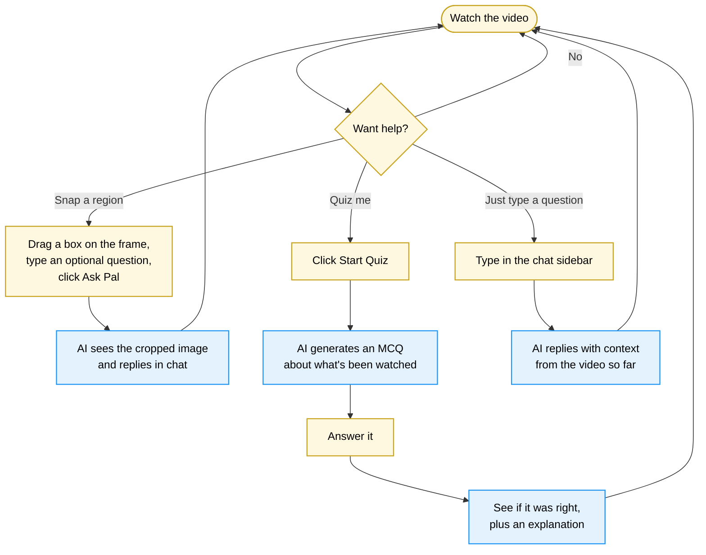

# Section 2a: The Intermittent Prototype

## 2a.1 The design hypothesis

The Intermittent prototype is built around a single design idea: the AI should be available, but it should never speak first. The participant always has a chat sidebar open, and there are two extra ways of asking the AI for help, by snapping a region of the video, or by asking for a quiz question. Every one of those interactions begins with a deliberate click. The AI remains silent until the learner explicitly requests support.

This is the most restrained of the three designs, and that is the point. It serves as the **control condition** in the comparison: it tells us what learners do when generative help is *available but invisible*. Anything the other two prototypes produce, including extra engagement, more constructive behaviour, or better quiz performance, has to be measured against this baseline. If the silent version already produces strong engagement, the case for active AI is weaker. If the silent version produces little, the case is stronger.



## 2a.2 What is on the screen

The screen has three columns. On the left, a thin rail with a settings icon. In the middle, the video player and its controls. On the right, the chat sidebar, which is the same "Ask Pal" interface that appears in every prototype.

Just below the video are two **feature cards**, the only places where AI can be invoked beyond the chat:

- **Snap to ask Pal**, for asking about something visible on screen.
- **Quiz me now**, for testing oneself on what has been covered so far.

Below those is the transcript, scrolling automatically as the video plays. Clicking any line jumps the video to that timestamp.

<figure class="screenshot">
  
  <figcaption><strong>Screenshot 2a-A.</strong> The default state: video at the top, two feature cards (Snap and Quiz) below it, the transcript further down, and the chat sidebar on the right. The chat is empty; suggested prompts are offered as starting points. Nothing has happened yet, this is what every session begins with.</figcaption>
</figure>

## 2a.3 The Snap-to-ask flow

This is the most distinctive interaction in this prototype, and it is worth walking through in detail.

When the learner sees something in the video they want to ask about, such as a diagram, a label, or a part of an equation, they click **Select Area**. The video pauses, and a hint strip appears: *Drag to select an area, then ask Pal.* They drag a rectangle on the frame. Below a minimum size (28 × 28 pixels) the rectangle is rejected, so an accidental click cannot trigger a snap.

Once they release, a confirmation card appears with their selection visible, an optional text field ("Ask about this..."), and **Ask Pal** / **Cancel** buttons. They can refine what they are asking before sending.

<figure class="screenshot">
  
  <figcaption><strong>Screenshot 2a-B.</strong> The selection-confirm step. The learner has drawn a rectangle around part of the diagram and is about to type a question or click Ask Pal directly. The rectangle is editable up to this point; once they confirm, the frame is captured.</figcaption>
</figure>

Clicking **Ask Pal** triggers the browser's screen-share permission prompt. The learner picks the tab containing the video, and a single frame is grabbed. Importantly, the system captures *what is actually on the screen at that moment*, including any subtitles or zoom state, rather than reading directly from the video file. That matches the mental model of "what I am looking at right now". The trade-off is the visible permission dialog, which adds a little friction.

The captured frame is cropped to the selection rectangle and encoded as a JPEG image. That image, along with a synthesised prompt that includes the timestamp and a 50-second window of surrounding transcript, is sent to the AI. The reply appears in the chat as a normal message, but with a thumbnail of the snapped region attached so the participant (and the researcher, later) can see exactly what was asked about.

<figure class="screenshot">
  
  <figcaption><strong>Screenshot 2a-C.</strong> The result of a snap. The user's chip in chat carries a thumbnail of what they asked about; the AI's reply below is a normal markdown response. Everything (the image, the prompt, the response) is also saved to the database for later review.</figcaption>
</figure>

## 2a.4 The Quiz-me-now flow

The quiz works differently to the snap. There is no automatic firing; the learner has to click **Start Quiz** to see anything. When they do, the modal opens with a brief loading spinner while the AI generates a question.

The question itself is a multiple-choice question (MCQ): four options, one correct. Behind the scenes, the AI is given the full transcript watched so far, the difficulty level for this attempt, and a list of every question already asked in this session (so it does not repeat itself). The four answer options are then shuffled on the server before being shown, which stops the AI's habit of always making the first option correct.

<figure class="screenshot">
  
  <figcaption><strong>Screenshot 2a-D.</strong> The quiz modal shows a single question with four answer options. The numbered pills at the top represent past questions in this session, and clicking any of them lets the learner revisit a previous attempt and its explanation.</figcaption>
</figure>

Once the learner submits an answer, the modal switches into feedback mode: the correct option turns green, the chosen one (if wrong) turns red, and a short explanation appears below.

<figure class="screenshot">
  
  <figcaption><strong>Screenshot 2a-E.</strong> The feedback state. The learner sees not only whether they were right, but a short explanation of why, written by the AI, and an option to ask Pal for more detail in chat.</figcaption>
</figure>

**Adaptive difficulty.** The quiz tracks consecutive correct answers in a hidden counter. Two right in a row, and the next question is bumped up a level (Conceptual → Applied → Creative; the AI is told to write harder questions). One wrong, and the counter resets. The participant does not see the difficulty number, only the experience of harder questions when they are doing well.

**Question history.** The numbered pills at the top of the modal are persistent across the whole session. The learner can close the modal and re-open it many times; the history is always there, ready to be revisited. Whether participants actually use this, by clicking back into a question for review, is itself a research signal.

## 2a.5 What is happening in the code

Most of the complexity in this prototype lives on the client side, in a single state machine that drives the screen between modes:

```
default_viewing → selection_mode → selection_confirm → default_viewing
default_viewing → quiz_loading → quiz_open → quiz_feedback → default_viewing
```

There is **no background loop**. The server has no `/api/analyse` route at all; that route exists only in the other two prototypes. The Intermittent server is genuinely smaller, with only six endpoints (sessions, chat, quiz, snaps, events, and export). This is part of why the project was built as three separate apps rather than one with toggles: the differences are visible all the way down to the file system.

The pieces of state that matter most:

| Variable | What it tracks |
|---|---|
| `mode` | Which screen the learner is on (default viewing, selecting a region, quiz open, etc.) |
| `selectionRect` | The bounding box of the snap as it is being drawn |
| `currentQuiz`, `quizHistory`, `askedQuestions` | The active question, plus everything previously asked |
| `quizDifficulty`, `consecutiveCorrect` | The hidden adaptive difficulty state |
| `messages` | The chat history |
| `participantId`, `pidConfirmed` | Whether the modal has been confirmed (the gate that decides whether the database is touched at all) |

## 2a.6 The AI prompts

Three different prompts are used:

| Where | What the prompt contains |
|---|---|
| Chat | A description of who Pal is, the current video timestamp, the last six lines of transcript, the participant's quiz history, any past snaps, and an instruction to never cite the video as a source. |
| Snap | The same chat system prompt, plus a user message containing the timestamp, a 50-second transcript window around it, and the cropped image. |
| Quiz | The full transcript watched so far, an instruction at the current difficulty level, the list of previously-asked questions, and a strict quality gate (no verbatim recall, no joke options, distractors must be plausible misconceptions). |

Every chat exchange is also tagged in the database with a `source` label (`chat`, `snap_ask`, `quiz_explain`), so genuine conversational use can later be separated from incidental help-seeking in the analysis.

## 2a.7 Events that are unique to this prototype

In addition to the shared events listed in Section 1.5, the Intermittent prototype logs:

| Event | When it fires | What it tells us |
|---|---|---|
| `snap_started` | The learner clicks **Select Area** | They began a snap, regardless of whether they finished one. |
| `snap_cancelled` | The confirmation card was cancelled | They abandoned a snap. The ratio of cancelled to completed is a measure of confidence or hesitation. |
| `snap_completed` | The capture and AI call both succeed | A snap actually went through. |
| `quiz_started` | They clicked **Start Quiz** | Self-initiated assessment is one of the very few "AI suggestion shown" moments in this prototype. |
| `quiz_correct` / `quiz_wrong` | They submitted an answer | Includes time-to-answer and difficulty. |
| `quiz_skipped` | They closed the modal without submitting | A signal of disengagement. |
| `quiz_review_opened` | They clicked a history pill | Genuine review behaviour, going back to look at a past question. |

In the export's *Comparable* sheet, the count of `quiz_started` is what is reported as "AI suggestions shown" for this paradigm. The corresponding "AI suggestions accepted" is the count of any answered or completed quiz, plus completed snaps.

## 2a.8 The design decisions worth flagging

A handful of choices in this prototype are non-obvious, and deserve mention:

- **Real screen capture, not video-element reading.** Snaps use the browser's `getDisplayMedia` API rather than reading frames directly from the `<video>` element. This was deliberate. It matches "what I see on screen right now" rather than "what is in the video file". It also means subtitles, zoom levels, and any browser overlays get captured. The cost is the visible permission dialog.
- **Snap image data is persisted to the database.** Unlike the frame captures used in Continuous and Proactive, which are sent to the AI and discarded, Intermittent's snaps are saved. A researcher can later see exactly what each participant asked about. It also makes the database larger.
- **Quiz history is per-session, not per-learner.** Two different sessions for the same person produce independent quiz histories. This was a study-design choice; each session is meant to be a self-contained run.
- **Adaptive difficulty is hidden.** The difficulty number is never shown to the participant. They feel the questions getting harder, but they never see "Level 2" appear on screen. This avoids the gamification frame that would have changed the experience.

## 2a.9 What this prototype cannot do

A few honest limitations to note:

- The snap requires the participant to grant screen-share permission. If they deny it, the feature is unusable for that session.
- There is no "second look": once a snap is sent, the learner cannot re-crop or re-ask without starting over. Edit-after-send was considered and rejected; the friction of starting over makes each snap more deliberate, which is a study-relevant property.
- The chat does not have access to past snaps' images, only the text around them. Follow-up questions about a previously snapped diagram lose their visual context.
- The prototype assumes a participant with at least basic English literacy (the AI replies and the transcript are both English). This is a common limitation across all three.
