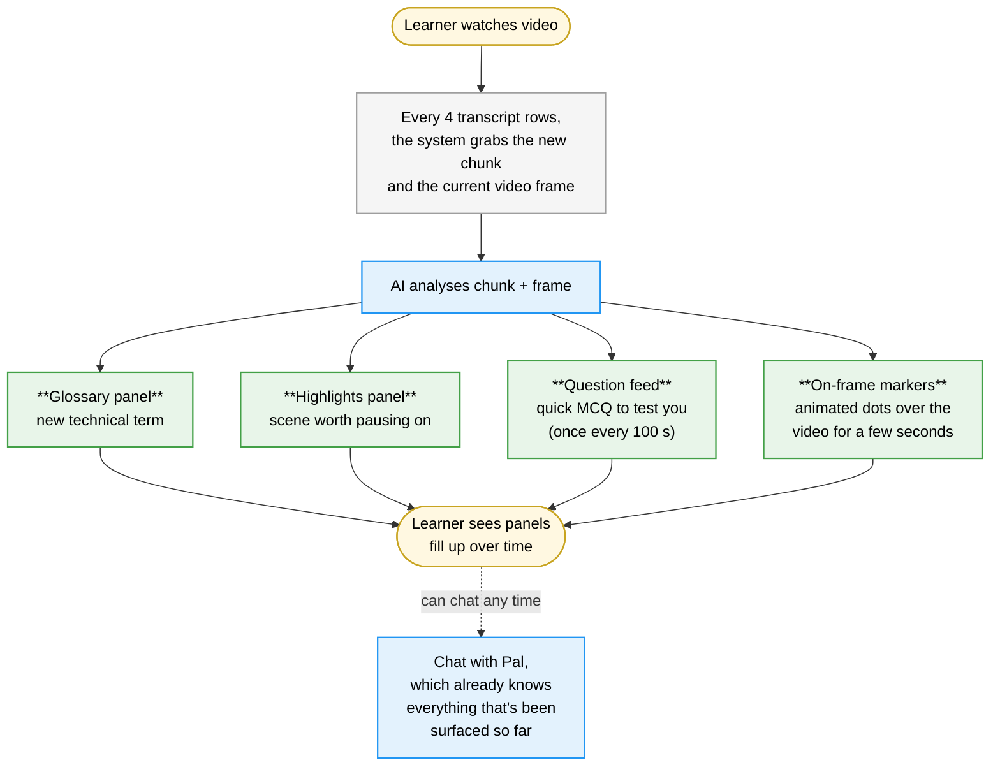

# Section 2b: The Continuous Prototype

## 2b.1 The design hypothesis

The Continuous prototype is built around a different hypothesis from Intermittent: the AI should not wait to be asked, but it should not interrupt either. Instead, it should always be present, quietly populating side panels with relevant content as the video plays. The learner can sample what they want, when they want; nothing demands attention, nothing pauses the video, but help is always within reach.

Where Intermittent provides on-demand AI support that remains hidden until the learner requests it, Continuous provides ambient AI support that is always visible alongside the video. The cost of looking at help is reduced almost to zero, because the help is already there.

Three streams of content build up as the video plays: a **glossary** of technical terms being introduced, a feed of **explore highlights** worth pausing on, and a paced feed of **live questions** to test understanding. Each stream lives in its own panel; each accumulates over time. The chat sidebar is still available for free-form questions, just as in Intermittent.

## 2b.2 What is on the screen

The layout is the same three-column shell as Intermittent, but the content is very different. The video player is still in the centre, but immediately below it is a horizontally split **secondary row** containing two panels side by side: the highlights feed on the left, the live question feed on the right. The right column is divided in two by a draggable divider: the glossary panel takes the top half, and the chat sits in the bottom half.

This means the learner is looking at four streams of information at once: the video, the highlights and questions below it, and the glossary and chat to its right. The visual challenge is that none of these should compete with the video for attention, but all of them should be glanceable.

<figure class="screenshot">
  
  <figcaption><strong>Screenshot 2b-A.</strong> The defining state of this paradigm. After a few minutes of playback, the glossary on the right has accumulated several technical terms; the highlights panel has at least one scene to revisit; the live question feed has surfaced a question. The learner has done nothing to make any of this happen.</figcaption>
</figure>

## 2b.3 The four streams of generated content

Each time the AI runs in the background, it produces up to four kinds of output, each routed to a different surface.

| Stream | Where it appears | How much per run | What stops it from repeating |
|---|---|---|---|
| **Glossary terms** | Right-column panel; new entries slide in | Up to 2 new terms | A blocklist of generic English words, plus dedup against everything already shown |
| **Highlights** | Secondary-row left panel | At most 1 | Fuzzy-substring dedup against everything already shown, so "neural network diagram" and "the neural net diagram" are recognised as duplicates |
| **Questions** | Secondary-row right panel | At most 1 | A 100-second timer between questions, regardless of how many the AI proposes |
| **Region markers** | Animated dots on the video itself | Up to 3 per run | Coordinate clamping; minimum size; the dots disappear after a few seconds |

The glossary and highlights are persistent; they keep accumulating. The on-frame region markers are deliberately transient; they appear with a subtle entry animation, hold for about four seconds, and dismiss themselves. They are closer to "look here for a moment" than to "here is something to revisit later".

<figure class="screenshot">
  
  <figcaption><strong>Screenshot 2b-B.</strong> The glossary panel header. There is a small "Stop" button that pauses the glossary feed (without affecting the others), and a provider toggle that cycles between AI providers if needed. The same controls appear above each of the other panels.</figcaption>
</figure>

<figure class="screenshot">
  
  <figcaption><strong>Screenshot 2b-C.</strong> A live question card. Four answer options, no selection yet. The numbered pills above the card represent past questions; the participant can navigate back to any of them at any time.</figcaption>
</figure>

<figure class="screenshot">
  
  <figcaption><strong>Screenshot 2b-D.</strong> A region marker in the middle of its lifetime. Concentric circles draw the eye to a specific element, here an axis label, for a few seconds before dismissing. It is the briefest of interventions.</figcaption>
</figure>

<figure class="screenshot">
  
  <figcaption><strong>Screenshot 2b-E.</strong> The post-answer state of a feed question. Correct/wrong is indicated visually; an "Explain this answer" link routes the question into chat for a deeper conversation if the learner wants one.</figcaption>
</figure>

<figure class="screenshot">
  
  <figcaption><strong>Screenshot 2b-F.</strong> Chat awareness in action. The learner has asked a follow-up question; Pal's reply assumes the term that was already surfaced in the glossary panel rather than redefining it. The cross-feature context is what makes this feel like one assistant rather than four disconnected ones.</figcaption>
</figure>

## 2b.4 The background loop, in plain language

What turns this into an "ambient" experience is a small piece of logic that runs continuously while the video plays. It works like this:

1. The participant's video position is sampled every half-second.
2. Whenever four new transcript rows have been covered since the last analysis, the loop fires.
3. The system grabs the most recent chunk of transcript (between four and twelve rows). If a video frame is available, it captures a small JPEG of what is currently on screen (480 × 270 pixels, compressed to about 20 KB).
4. The chunk and the frame are sent to the AI, along with everything that has already been surfaced in this session (so it knows what not to repeat) and the participant's last few chat messages (so it knows what they are already exploring on their own).
5. The AI responds with up to four streams of output (glossary, highlights, questions, regions), and each stream is routed to its corresponding panel.

The 100-second question throttle deserves an explanation of its own. Without it, the AI would happily produce a question on almost every analysis run, which during one early pilot meant **eight questions in three minutes**. The throttle ensures roughly one question per 100 seconds of playback, about ten questions across the 17-minute video, which matches what felt natural to participants. The timer runs on the participant's actual video position, so pausing the video pauses the timer.

## 2b.5 Per-feed pause controls

Each of the three accumulating panels has its own pause/resume button. This was a design decision worth flagging: a single "stop everything" button would have been simpler, but it would have collapsed three distinct cognitive loads into one signal. By giving each panel its own pause, the data tells us *which* stream a participant found overwhelming. Some participants paused glossary but kept questions running. Some did the opposite. Those choices are themselves data.

A paused panel keeps showing what is already there; new content for that stream is silently dropped while it is paused.

## 2b.6 What the chat knows about everything else

In Intermittent, the chat is informed by quiz history and snap history. In Continuous, the chat is informed by *all four* streams: every glossary term, every highlight, every question, plus the participant's previous messages. When the participant asks Pal a question, the system prompt already lists everything they have seen.

This has a concrete effect on the conversation. If the glossary already explained "activation function", the chat does not redefine it from scratch; it builds on top of it. If the question feed has just surfaced a question about gradient descent, a follow-up chat message about that topic gets a reply that addresses the participant's specific misconception (because the wrong answer they picked is in the prompt too).

The same context flows in the other direction: when the analysis loop runs, the participant's last few chat messages are passed to the AI so it does not waste a glossary slot on a term they are already discussing in chat.

## 2b.7 What is happening in the code

The Continuous client manages substantially more state than Intermittent because it has to track each accumulating stream separately:

| Variable / ref | What it tracks |
|---|---|
| `liveGlossary`, `liveHighlights`, `liveQuestions` | The three accumulating arrays, one per panel |
| `frameRegions` | The transient on-frame markers currently being rendered |
| `lastAnalysedRowRef` | The position of the last transcript row analysed (drives the four-row gate) |
| `lastQuestionAtRef` | The video time of the last question that made it past the throttle |
| `isAnalysingRef` | A flag that prevents two analysis calls running at once |
| `feedDifficulty`, `feedConsecCorrect` | The adaptive difficulty for the live question feed |

A small but important pattern: every accumulating array exists *both* as React state (so the UI re-renders when it changes) *and* as a ref (so the analysis callback can read its current value without restarting). This is unavoidable when you have a long-lived background loop reading from rapidly changing state.

The new server route in this prototype is `/api/analyse`. Given a transcript chunk, an optional frame, and the previous-content arrays for dedup, it returns the four streams of output. The same route exists in Proactive but with different prompt rules.

## 2b.8 Events that are unique to this prototype

Beyond the shared events listed in §1.5, Continuous logs:

| Event | When it fires | What it tells us |
|---|---|---|
| `glossary_term_clicked` | The learner clicks a glossary entry | They engaged with a surfaced term rather than just glancing at it. |
| `feed_question_unlocked` | A question cleared the throttle and entered the feed | The system surfaced an AI suggestion. |
| `feed_question_answered` | The learner submitted an answer | Includes correctness, difficulty, and time-to-answer. |
| `feed_question_skipped` | They explicitly skipped a question | A rejection of the AI suggestion. |
| `feed_question_jumped` | They clicked a past question pill | Review behaviour. |
| `feed_paused` / `feed_resumed` | They toggled the pause control on a feed | Tells us which stream they chose to mute. |
| `highlight_detail_clicked` | They clicked the Detail button on a highlight | Routes the highlight into chat for a deeper explanation. |
| `explain_answer_clicked` | "Explain this answer" link after a feed question | Help-seeking after submission. |

In the *Comparable* export, "AI suggestions shown" combines `feed_question_unlocked` with `highlight_detail_clicked`. "AI suggestions accepted" combines answered questions, glossary clicks, and explain-requests. "AI suggestions rejected" combines skipped questions and pause events.

## 2b.9 The design decisions worth flagging

- **Three feeds, not one combined feed.** An earlier sketch tried to put glossary, highlights, and questions in a single chronological column. Pilot participants reported it was harder to scan than three separate panels, because the eye could not predict which kind of content was where. Splitting them made each surface scannable on its own terms, even at a glance.
- **Time-based throttle, not chunk-based throttle.** The 100-second gap between questions is in playback time, not analysis count. This way, a participant who pauses heavily is not bombarded when they resume, and a participant who watches at 2× speed is not starved.
- **Per-feed pause, not global.** Discussed above. Letting participants regulate one stream at a time produces a richer signal for analysis than a single panic button.
- **Chat context fed back into analysis.** This closes the loop between the chat and the panels. Without it, the same term would appear in glossary that the participant had just spent five minutes asking about in chat.

## 2b.10 What this prototype cannot do

- The four-row analysis gate assumes the participant moves forward through the video. Heavy seeking, especially backwards, can momentarily starve the loop until enough new rows are covered.
- On-frame region markers depend on local-video frame capture. If the same study were run on YouTube embeddings, the regions would silently disappear, leaving only three streams.
- The chat-context window passed back to analysis is hard-capped (last four messages, 120 characters each). Long-running conversational threads lose detail at this boundary.
- "Pause" only freezes the *acceptance* of new items, not the underlying AI call. A paused feed still consumes API tokens. A future version could short-circuit the call entirely when all panels are paused.
- The live question feed has its own adaptive difficulty, but that information does not propagate back to the AI. The AI does not know it should generate harder questions for a participant who has been getting them right.
