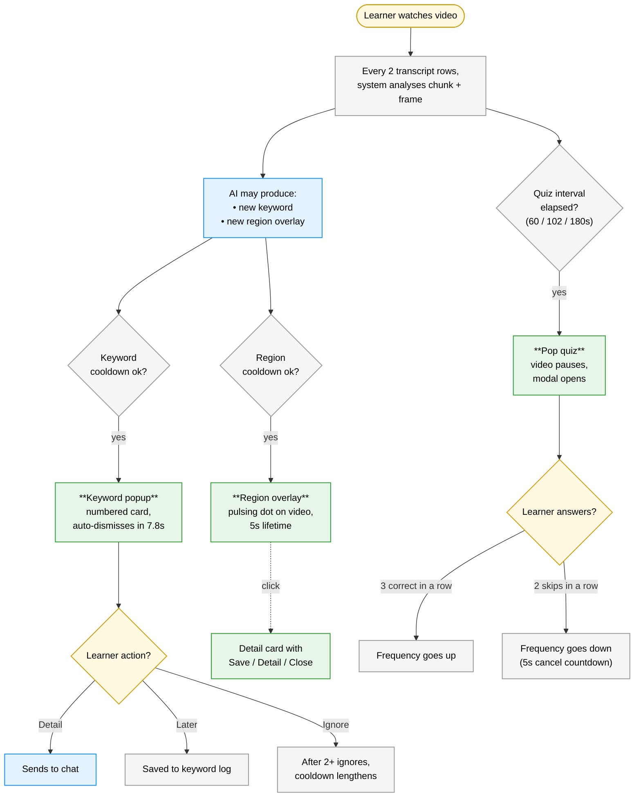

# Section 2c: The Proactive Prototype

## 2c.1 The design hypothesis

The Proactive prototype takes the most system-led position of the three: system-initiated support should surface at selected learning moments, when the system judges that an intervention is likely to help. Rather than remaining in the periphery as it does in Continuous, support is brought into the learner's direct line of sight through three distinct intervention types:

- **Keyword popups**, numbered cards that appear over the bottom-right of the player whenever a new technical term is introduced.
- **Region overlays**, pulsing markers that draw the eye to a specific element on the video frame, with a click-to-expand detail card.
- **Pop quizzes**, short multiple-choice questions that briefly pause playback, with their frequency tuned automatically based on whether the learner is engaging.

Where Continuous provides ambient support that the learner may glance at, Proactive surfaces support directly in the learner's line of sight. The learner can ignore any intervention, but every ignore is itself a measured signal, because the intervention was visible.

This makes Proactive both the most system-driven and the most adaptive of the three. Support does not only appear without an explicit request; the system also observes how the learner responds and adjusts its own pacing accordingly.

## 2c.2 The frequency setting

A single Low / Medium / High control governs the pacing of every intervention. The learner can change it from the small pill toggles inside each feature card. The same setting also flows into the AI prompt: *Low* does not just delay regions, it tells the AI to be far more selective about emitting them at all.

| Setting | Time between keyword popups | Region cooldown | Time between pop quizzes | The instruction the AI receives |
|---|---|---|---|---|
| **Low** | 35 s base | 60 s | 180 s (3 min) | "Expect 0 regions per chunk; at most 1 across many chunks." |
| **Medium** | 20 s base | 40 s | 102 s (~1.7 min) | "Expect 0 or 1 per chunk." |
| **High** | 12 s base | 25 s | 60 s (1 min) | "Expect 0 or 1 per chunk, occasionally a second." |

In other words, lowering the frequency setting does not just *delay* interventions; it changes what the AI considers worth surfacing in the first place. This was important: a "Low" that simply throttled output would have produced the same low-quality material spaced further apart. Telling the AI to be choosier raises quality, not just rarity.

## 2c.3 What is on the screen

The base layout matches the other two prototypes (left rail, video and panels in the centre, chat on the right). What is different is the set of overlays:

- A **keyword popup card** appears in the bottom-right of the player when a new term is surfaced.
- **Pulsing markers** can appear directly on the video frame, drawing attention to specific elements.
- A **pop quiz modal** can pause playback at any time.
- A **keyword log panel** sits in the bottom-right corner of the screen, expandable, holding every keyword that has been shown so far.
- The two feature cards below the video (Explore Highlights, Pop Quiz) carry frequency pills and small *i* info-icons that explain what each card does.

<figure class="screenshot">
  
  <figcaption><strong>Screenshot 2c-A.</strong> A keyword popup in flight. The card sits over the bottom-right of the video, numbered (#1, #2…), with the term and a one-sentence definition. Three actions: Detail (sends to chat), Later (keep it in the log), or just let it auto-dismiss.</figcaption>
</figure>

<figure class="screenshot">
  
  <figcaption><strong>Screenshot 2c-B.</strong> A region overlay during its 5-second window. The pulsing marker draws attention to a specific element of the diagram, here a node, that the AI judged worth pointing out at this exact moment.</figcaption>
</figure>

<figure class="screenshot">
  
  <figcaption><strong>Screenshot 2c-C.</strong> Clicking a region overlay opens this detail card. Three actions: Save (keep it), Detail (route to chat for explanation), Close. The video stays paused while the card is open.</figcaption>
</figure>

<figure class="screenshot">
  
  <figcaption><strong>Screenshot 2c-D.</strong> A pop quiz mid-question. The frequency pill toggle is visible at the top right of the modal, so the learner can downgrade the rate without skipping. The video stays paused until the question is dismissed.</figcaption>
</figure>

<figure class="screenshot">
  
  <figcaption><strong>Screenshot 2c-E.</strong> The post-answer state. Correct or wrong is indicated visually; an explanation follows. From here the learner can ask Pal to explain in detail (which routes the question into chat) or close the modal and resume the video.</figcaption>
</figure>

<figure class="screenshot">
  
  <figcaption><strong>Screenshot 2c-F.</strong> The keyword log expanded. Every keyword that has been surfaced, taken from popups whether dismissed or not, accumulates here. Pinned keywords get an amber treatment and rise to the top.</figcaption>
</figure>

<figure class="screenshot">
  
  <figcaption><strong>Screenshot 2c-G.</strong> The adaptive-frequency toast. After two skipped pop quizzes in a row, the system proposes to downgrade the frequency. A small countdown gives the learner five seconds to cancel, preserving agency without making them confirm explicitly.</figcaption>
</figure>

## 2c.4 The three intervention pipelines

Each intervention type has its own logic. They run independently of one another, but share a few cross-cutting safeguards.

### Keyword popups

When the analysis loop returns a new technical term, it goes into a queue. The system tries to show one popup at a time. A popup actually surfaces only when *all* of these conditions are met:

- The video is currently playing.
- No other intervention is on screen (no quiz open, no detail card, no other popup).
- Enough time has passed since the last popup. The gap is 12, 20, or 35 seconds depending on frequency, with up to 16 extra seconds added if the learner has been ignoring popups.
- The transcript is not currently *dense*, defined as more than 3.5 spoken words per second over the previous 12-second window. This stops popups from interrupting fast definitions.

If a popup does surface, it shows for 7.8 seconds and then fades. The learner has three options:

- **Detail** adds an explainer message to chat, with the keyword as context.
- **Later** keeps the keyword in the log without sending it to chat.
- **Ignore** lets the timer run out. After two consecutive ignores, the system extends the gap between popups by 16 seconds; this is the system inferring "keywords are not useful to this learner right now".

Every keyword that has ever surfaced, whether dismissed, sent to chat, or ignored, accumulates in the **keyword log** panel in the bottom-right corner. The learner can open it at any time and pin the entries they want to revisit.

### Region overlays

Regions arrive on the same analysis response as keywords, but they are gated separately. The AI returns coordinates for a region using a centre-based system (`cx`, `cy`, `width`, `height`, all as percentages of the video frame); the server normalises this to a top-left rectangle and clamps it inside the frame so a marker can never land off-screen.

A region surfaces only when no other intervention is active, the region cooldown has elapsed (25, 40, or 60 seconds depending on frequency), and the highlights feed is not paused. It lives for 5 seconds of *playback time*, so pausing the video pauses the timer, and seeking past the moment auto-dismisses the marker.

A click on the marker opens the detail card with three actions: Save, Detail (which routes to chat), and Close.

### Pop quizzes

The pop quiz is the heaviest intervention because it actually pauses the video. It is also the only one of the three that is **time-driven**, not content-driven. It fires when an interval elapses, not when the AI produces something new.

The interval depends on frequency (60, 102, or 180 seconds). On top of that, the quiz is held back if any of these are true:

- An intervention happened in the last 15 seconds (we do not want a keyword popup followed immediately by a quiz).
- The transcript is currently dense.
- The AI judges that the recent material is not substantive enough to support a meaningful question, in which case it returns a special `{"skip": true}` response and no quiz fires. The next attempt is scheduled sooner.

When a quiz does fire, the video pauses and the modal opens. The learner can answer (and see correct/wrong feedback with an explanation), or skip. Their pattern of responses then drives the **adaptive frequency**:

| What the learner is doing | What the system does | How it tells them |
|---|---|---|
| Answering 3 correctly in a row | Bumps the frequency up (Low → Medium → High) | A quick toast notification |
| Skipping 2 in a row | Bumps the frequency down (High → Medium → Low) | A toast with a 5-second cancel countdown |
| Answering wrong | Resets both streak counters | Nothing |

The auto-downgrade is reversible on purpose: a 5-second window with a *Stay on Medium* button lets the learner override the system's interpretation of their behaviour. This preserves their agency without forcing them to confirm anything when they do not want to. Whether they cancel or accept the downgrade is itself a logged event, and a good signal for the analysis.

## 2c.5 What the chat knows about everything else

The Proactive chat, like the Continuous chat, is informed by everything the AI has surfaced in this session, but the list is different. It includes:

- The last six lines of transcript (current context).
- The participant's quiz history (so the AI can address misconceptions directly).
- Up to ten recent surfaced keywords (so the chat does not redefine them).
- Up to five recent surfaced regions (so a follow-up question about "that diagram" makes sense).

The same context is also fed back into the analysis loop, so the AI does not waste a keyword slot on something the participant just asked Pal about.

## 2c.6 Two pieces of prompt engineering worth highlighting

The Proactive prototype's prompts contain two ideas that generalise well beyond this project.

### The "12-year-old rule"

In early pilots, the AI cheerfully promoted words like "graph", "curve", and even the StatQuest video's surface-level analogies ("dosage", "efficacy") to glossary status. None of these are technical terms. The fix was a simple addition to the prompt:

> *If a smart 12-year-old already knows what the word means in everyday English, it is NOT a glossary term, even if the speaker just used it. Only surface terms whose technical meaning is non-obvious from common usage.*

That rule, plus a server-side blocklist of about thirty common offenders, suppressed the bad keywords almost entirely. It is a reminder that AI prompts often need to be told what *not* to do as explicitly as what to do.

### Region strictness, parameterised by frequency

The same chunk of transcript, with the same frame, can produce zero region overlays at the **Low** setting and one region at **High**, *without changing any client-side logic*. The trick is that the strictness phrasing is interpolated into the AI prompt itself based on the current setting:

> **Low.** "Only emit a region when pausing playback to look at this exact area would meaningfully change the learner's understanding right now. Default to []. When in doubt, return []."
>
> **Medium.** "Emit a region only when a specific on-screen element is the focal point of the current explanation AND the learner would clearly benefit from the system pointing it out. When in doubt, return []."
>
> **High.** "Emit a region when a specific element on screen is being actively referenced and pointing it out would help the learner. Still skip transitional, decorative, or speaker-only frames."

This means lowering frequency genuinely raises the bar for what counts as a worthwhile interruption, rather than just delaying the same low-quality candidates.

## 2c.7 What is happening in the code

The Proactive client tracks more state than either of the other prototypes, because each of the three intervention pipelines has its own pacing logic, its own cooldowns, and its own adaptive counters.

| Variable / ref | What it tracks |
|---|---|
| `liveKeywords`, `liveKeywordsRef` | The queue of keywords waiting to be shown |
| `keywordLog` | The persistent numbered log in the corner panel |
| `activeKeywordPrompt` | The popup currently visible on screen |
| `frameRegions` | Region overlays currently being drawn |
| `surfacedHighlightsRef` | Every region ever shown (used for dedup and chat context) |
| `activeQuiz`, `quizSelection`, `quizOutcome`, `quizHistory` | The pop quiz modal's state and history |
| `consecutiveSkips`, `consecutiveAnswered` | The streak counters that drive adaptive frequency |
| `quizFrequency`, `selectedFrequency` | The current setting (quiz and visual frequency are independent) |
| `quizPaused`, `highlightsPaused` | Per-feature pause states |
| `freqDownCountdown` | The 5-second cancel window for auto-downgrades |
| `lastQuizAt`, `lastVisualNudgeAtRef`, `lastAnalysedRowRef` | Pacing refs |

The pattern of "state for re-rendering, ref for stale-free reads from a long-lived callback" recurs many times here. It is the price of having a background loop that needs to read the current state of half a dozen pacing counters every few seconds.

## 2c.8 Events that are unique to this prototype

Proactive logs the largest event vocabulary of the three prototypes:

| Event | When it fires | What it tells us |
|---|---|---|
| `keyword_shown` | A popup appears | The system surfaced a keyword. |
| `keyword_ignored` | The 7.8-second timer ran out without action | The participant did not engage. |
| `keyword_dismissed` | They explicitly closed the popup | An active rejection. |
| `keyword_later` | They clicked Later | Deferred but not rejected. |
| `keyword_pinned` | They pinned a keyword in the log | Strong engagement with that term. |
| `keyword_detail` | They clicked Detail (routes to chat) | Strong engagement, conversational. |
| `visual_opened` | They clicked a region overlay | Engagement with a region. |
| `visual_saved` / `visual_detail` / `visual_closed` | The three actions in the detail card | Granularity of what they did with it. |
| `quiz_triggered` | A pop quiz fired | The system attempted a quiz. |
| `quiz_correct` / `quiz_wrong` / `quiz_skipped` / `quiz_detail` | The quiz interaction outcomes | Standard quiz signals. |
| `frequency_changed` | Manual or automatic frequency change | Tells us when the participant adjusted (and when the system did). |
| `highlights_paused` / `highlights_resumed` | Pause toggle on the highlights feed | Selective regulation behaviour. |

In the export, "AI suggestions shown" is the sum of `keyword_shown + quiz_triggered + visual_opened`. "AI suggestions accepted" is `keyword_detail + quiz_correct + quiz_wrong + visual_detail + visual_saved`. "AI suggestions rejected" is `keyword_dismissed + keyword_ignored + quiz_skipped + visual_closed`. The ratio of accepted to shown is the participant's **acceptance rate** for a paradigm where AI initiative produced every one of those moments, a signal that the other two prototypes cannot produce in quite the same way.

## 2c.9 The design decisions worth flagging

- **Three independent pipelines.** Keywords and regions share a cooldown (so they do not collide), but quizzes have their own. This prevents the worst failure mode (everything firing at once) while still allowing the second-worst (a keyword popup followed by a quiz 15 seconds later, which is actually fine in practice because the participant has time to read the popup and prepare for the quiz).
- **Adaptive frequency is reversible.** The 5-second cancel countdown is small but important; it gives the learner the last word without requiring them to confirm every system-initiated change. Whether they accept or cancel is a useful signal in its own right.
- **The keyword log lives in a corner, not in the chat sidebar.** Keeping the keyword log separate from the chat preserves the conceptual distinction: keywords are *interruptions* (system-initiated), chat is *deliberate help-seeking* (learner-initiated). Mixing them would have blurred this.
- **The density check.** This was added after pilot transcripts containing rapid-fire definitions ("a neuron, a layer, an activation, a weight") triggered popups mid-sentence. The threshold (3.5 spoken words per second over 12 seconds) is conservative; the trade-off is that some legitimate moments are also skipped. The cost of false-positive popups was judged higher than the cost of missed surfacing.
- **Frequency strictness is in the prompt, not the client.** This is worth restating. The same code, the same data, with a different setting, produces genuinely different content because the AI's emission policy itself changes. This is what makes Low feel calm rather than just slow.

## 2c.10 What this prototype cannot do

- The frequency setting only logs *when* a learner changes it, not *why*. A free-text rationale would be richer but would also add friction; the friction was judged not worth it for a study setup.
- The region coordinate system assumes the video is rendered at full visible resolution. If the player is letterboxed or scaled, the marker can land slightly off-target. We have not seen this in practice with the local 1080p MP4, but it is theoretically possible.
- Like Continuous, Proactive depends on local-video frame capture; YouTube embeds cannot be canvas-read.
- The pop-quiz skip gate (`{"skip": true}`) trusts the AI's self-assessment of content quality. When the AI is wrong about that, the participant does not see a quiz they could have benefited from. There is no fallback; this is an honest limitation.
- There is no learner model. Adaptive frequency is reactive (skips and correct streaks) rather than diagnostic (which concepts is this learner weak on). Concept-level adaptivity would be a natural next step.
