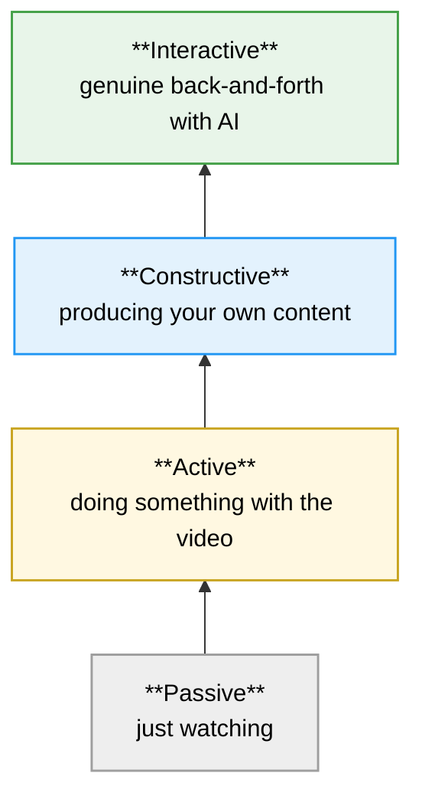
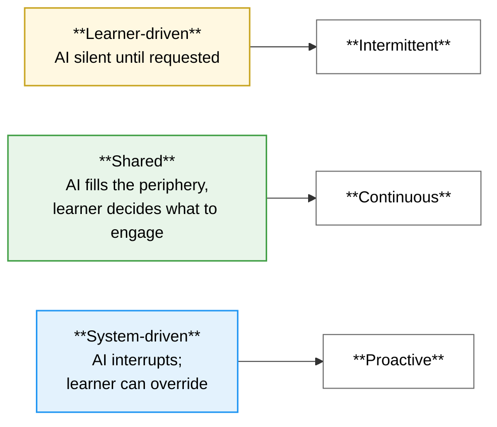

# Section 3: Putting the Three Side by Side

Now that each prototype has been described on its own terms, this section pulls them into a single view. The goal is to make the three positions in the design space visible at a glance, and to show how the same idea (a quiz, say, or a "highlight") shows up differently in each.

## 3.1 The three positions in one sentence each

| Prototype | The position it takes |
|---|---|
| **Intermittent** | *Help is always available, but it never speaks. The learner has to invoke it.* |
| **Continuous** | *Help is always visible in the periphery. The learner samples what they want.* |
| **Proactive** | *Help captures attention deliberately. The learner can override the system, but the system pushes.* |

These three sentences are also the three competing hypotheses the user study tests against one another.

## 3.2 The defining differences, side by side

Most of the underlying machinery is shared. The genuine differences are concentrated in a small set of design decisions, summarised below.

| Question | Intermittent | Continuous | Proactive |
|---|---|---|---|
| Does the AI speak first? | Never | Yes, in side panels, ambient | Yes, through popups, overlays, quizzes |
| Does anything ever interrupt the learner? | No | No (only animations on entry) | Yes, pop quizzes pause the video |
| Is there a background analysis loop? | No | Yes, every 4 transcript rows | Yes, every 2 transcript rows |
| Does the learner crop frames manually? | Yes (the Snap feature) | No | No |
| Are there persistent feeds in the UI? | None | Glossary, highlights, questions | Keyword log; the rest are transient |
| Is there a frequency setting? | n/a | n/a | Yes, Low / Medium / High |
| Does the AI tune its own pacing? | No | No | Yes, auto up/down from learner behaviour |
| What is the largest source of complexity? | The snap-to-ask flow | The accumulating side panels | The three intervention pipelines |

## 3.3 The same idea, three different shapes

It is worth tracing how a single concept, for example "quiz", actually appears across the three prototypes. The idea is the same, but the shape it takes is quite different.

| Concept | In Intermittent | In Continuous | In Proactive |
|---|---|---|---|
| **A quiz question** | Lives in a modal that opens only when the learner clicks *Start Quiz*. They control when. | Surfaces in a side feed automatically as the AI sees fit, paced by a 100-second timer. They can choose to engage. | Pauses the video and demands attention through a modal. Frequency adapts to behaviour. |
| **A glossary term** | (No equivalent feature.) | Slides into a panel quietly; persists until removed. | Bursts into a popup card for 7.8 s; auto-dismisses if ignored; ends up in a corner log. |
| **A visual cue on the frame** | Done manually by cropping a region with Snap. | Brief animated marker dots, ~4 s lifetime. | Pulsing amber overlays with a click-to-expand detail card. |
| **Asking about an image** | The defining feature: capture a screen region and send it to chat with a question. | (No equivalent feature.) | Possible via the region detail card's *Detail* button, which routes to chat. |
| **Asking the AI a free-form question** | Always available in the chat sidebar. | Always available; the AI is informed by the surfaced panels. | Always available; the AI is informed by the keyword log and region history. |

## 3.4 Mapping each prototype onto ICAP

The user study analyses engagement using the **ICAP** framework (Passive → Active → Constructive → Interactive). The intuition is straightforward: higher rungs are associated with deeper learning. *Passive* is just watching; *Active* is doing something with what is watched (pausing, seeking, scrolling the transcript); *Constructive* is producing content of one's own (asking a question, answering a quiz); *Interactive* is genuine back-and-forth dialogue.

The same behaviours do not always exist in all three prototypes, so each one's events bucket slightly differently. The table below shows the same rungs, populated with what each paradigm offers.

| Rung | Intermittent | Continuous | Proactive |
|---|---|---|---|
| Passive | Default baseline (just watching) | Default baseline | Default baseline |
| **Active** | Pause, seek, transcript click | Pause, seek, transcript click, glossary click | Pause, seek, transcript click, keyword pin |
| **Constructive** | Chat message, snap-to-ask, quiz answer | Chat message, feed-question answer, highlight detail, explain-answer | Chat message, pop-quiz answer, keyword detail, region detail |
| **Interactive** | Multi-turn chat after a snap or quiz | Chat that builds on already-surfaced terms or questions | Chat that follows from a keyword popup, region card, or quiz prompt |

The analytical question this sets up is straightforward: does AI initiative push engagement up the ICAP rungs? If the Continuous and Proactive prototypes show higher constructive and interactive event counts than Intermittent for the same total session time, that is evidence that initiative-driven content is producing richer engagement, not just more interaction.

## 3.5 How "AI suggestion shown" means three different things

The export sheet reports three counters that exist in all three prototypes (`ai_suggestions_shown`, `ai_suggestions_accepted`, `ai_suggestions_rejected`), and the ratio between them gives an *acceptance rate* per participant. But what counts as a "suggestion shown" is paradigm-specific:

| Counter | In Intermittent, this means... | In Continuous, this means... | In Proactive, this means... |
|---|---|---|---|
| Suggestions **shown** | the participant chose to invoke a suggestion (started a quiz) | the system put a suggestion on screen automatically | the system actively interrupted the participant |
| Suggestions **accepted** | they finished what they started | they engaged with the surfaced content | they engaged with the interruption |
| Suggestions **rejected** | they skipped the modal | they paused the feed or skipped a question | they ignored, dismissed, or skipped an intervention |

These three readings of the same number are exactly what makes the cross-paradigm acceptance rate interesting:

- An **Intermittent** acceptance rate measures *follow-through on a self-initiated request*. It is a property of the learner's discipline.
- A **Continuous** acceptance rate measures *whether passive presence translates to action*. It is a property of how attractive the feeds are.
- A **Proactive** acceptance rate measures *whether interruption produces engagement*. It is a property of how well the system's timing matches the learner's needs.

Each of these is a different question. None of them is more valid than the others. They are testing different things, and that is the point of having three prototypes.

## 3.6 Where each design lives in the agency spectrum

The three prototypes can also be placed on a spectrum of who is in charge of when AI shows up.

The leftmost position trusts the learner to know when they need help. The rightmost position trusts the system to know when intervention helps. The middle position tries to give both: content always available, never demanded.

What the user study is ultimately trying to find out is: for which kinds of learner, on which kinds of content, does each position produce the best learning? None of the three prototypes is obviously better than the others; the comparison is the design contribution.
